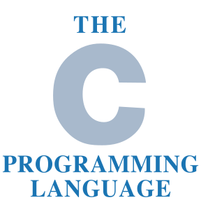

# C

<figure class="inline-flex">



</figure>

## 言語の基本

### 特徴

- ソースコードの可搬性 – 言語の核心に殆どハードウェア依存がない。
- マシンに近い演算能力
- 効率性

### ソースファイル

C のソースファイルは `.c` 拡張子を用い、次の内部構造を取ります：

- プリプロセッサ指令
- グローバル宣言
- 関数定義

### コメント

- ブロックコメント – `/* ... */`
- 行コメント – `// ...`

### 文字集合

#### 基本文字集合

- 基本ソース文字集合
  - 52個の英字 – `A` `B` `C` `D` `E` `F` `G` `H` `I` `J` `K` `L` `M` `N` `O` `P` `Q` `R` `S` `T` `U` `V` `W` `X` `Y` `Z` `a` `b` `c` `d` `e` `f` `g` `h` `i` `j` `k` `k` `l` `m` `n` `o` `p` `q` `r` `s` `t` `u` `v` `w` `x` `y` `z`
  - 10個の10進数字 – `0` `1` `2` `3` `4` `5` `6` `7` `8` `9`
  - 29個の記号文字 – `!` `"` `#` `%` `&` `'` `(` `)` `*` `+` `,` `-` `.` `/` `:` `;` `<` `=` `>` `?` `[` `\` `]` `^` `_` `{` `|` `}` `~`
  - 5つの空白文字 – _空白_、_水平タブ_、_垂直タブ_、_改行_、_改ページ_
- 基本実行文字集合
  - 4個の表示不能文字 – _ナル文字_（`\0`）、_アラート文字_（`\a`）、_後退文字_（`\b`）、_復帰文字_（`\r`）

文字の実際の数値、文字コードはC実装によって異なります。言語そのものは次の_条件_を課すに留まります：

- 基本文字集合の文字は1バイトで表すこと
- ナル文字は `00000000` とすること
- 0より後の10進数字の値は、前の数字より1だけ大きいこと

#### 拡張文字集合

基本文字集合と、それ以外の文字集合の和集合

#### ワイド文字とマルチバイト文字

- ワイド文字 – 文字集合の全ての文字に同じビット幅を用いる。型：`wchar_t`,`char16_t`,`char32_t`
- マルチバイト文字 – 複数のビット幅の文字が混在する文字集合。

#### ユニバーサル文字名

任意の拡張文字をユニバーサル文字名－－`\uXXXX` または `\UXXXXXXXX` の形式の Unicode 値－－に変換出来ます。

#### ダイグラフとトイグラフ

キーボード言語系によっては入力できない記号をサポートするため、代替記法が提供されています：

- ```c title="タイポグラフ – 2文字表記"
  /*
   ダイグラフ | 等価文字
  ----------+-------
   <:       | [
   :>       | ]
   <%       | {
   %>       | }
   %:       | #
   %:%:     | ##
  */
  
  // ダイグラフを使う例：
  int arr<::> = <% 10, 20, 30, %>;
  printf("The second array element is <%d>.\n", arr<:1:>);
  
  // ダイグラフを使わない例：
  int arr[] = {10, 20, 30};
  printf("The second array element is <%d>.\n", arr[1]);
  
  /* 出力：
  The second array element is <20>.
  */
  ```

- ```c title="トライグラフ – 3文字表記"
  /*
   トイグラフ | 等価文字
  ----------+-------
   ??(      | [
   ??)      | ]
   ??<      | {
   ??>      | }
   ??=      | #
   ??/      | \
   ??!      | |
   ??'      | ^
   ??-      | ~
  */
  // 次の文の2番目と3番目の疑問符をトライグラフの開始と解釈します：
  printf("Cancel???(y/n)");
  // 従って、この行は、意図しないプリプロセッサ出力になってしまいます：
  printf("Cancel?[y/n)");
  // このような場合、3文字連ををトライグラフとして解釈されないようにするには、疑問符をエスケープします：
  printf("Cance\?\?\?(y/n)");
  ```

### 識別子

識別子－－即ち、変数、関数、マクロ、構造体、その他のオブジェクトの名前－－には、次の文字が使用可能です：

- `A-Z`　および `a-z` – 大文字・小文字を区別します。
- アンダースコア `_`
- 10進数字 `0-9` – 但し識別子の先頭文字には使えません。
- 他の言語の文字や数字を表すユニバーサル文字名

一方、次の**_キーワード_**は予約されているため、使用できません：

`auto` `break` `case` `const` `continue` `default` `do` `double` `else` `enum` `extern` `float` `for` `goto` `if` `inline` `int` `long` `register` `restrict` `return` `short` `signed` `sizeof` `static` `struct` `switch` `typedef` `union` `unsigned` `void` `volatile` `while` `_Alignas` `_Atomic` `_Bool` `_Complex` `_Generic` `_Imaginary` `_Noreturn` `_Static_assert` `_Thread_local`

#### 識別子のスコープ

- ファイルスコープ
- ブロックスコープ
- 関数プロトタイプスコープ
- 関数スコープ

## 型

C で、**オブジェクト**とは内容が値を表すメモリの位置を指します。

### 型分類

- _基本型_
  - 標準整数型および拡張整数型
  - 実浮動小数点型および複素浮動小数点型
- 列挙型
- 型 void
- _派生型_
  - ポインタ型
  - 配列型
  - 構造体型
- 共用体型
- 関数型

更に、

- 基本型と列挙型はまとめて**算術型**と呼ばれます。
- 算術型とポインタ型はまとめて**スカラ型**と呼ばれます。
- 配列型と構造体型はまとめて**集約型**と呼ばれます。

## モジュール化


---

## 関連する外部リンク

### 言語解説

- [C言語リファレンス - cppreference.com](https://ja.cppreference.com/w/c)
- [C 言語のドキュメント | Microsoft Docs](https://docs.microsoft.com/ja-jp/cpp/c-language)
- [C Library | Code-Reference.com](https://code-reference.com/c)

### 主な処理系

大抵の処理系は C と C++ の両方をサポートしています。

- [Clang](https://clang.llvm.org/)
- [GCC](https://gcc.gnu.org/)
- [Microsoft Visual C++](https://www.visualstudio.com/ja/vs/cplusplus/)
- [Intel C++ Compiler](https://software.intel.com/en-us/c-compilers)
