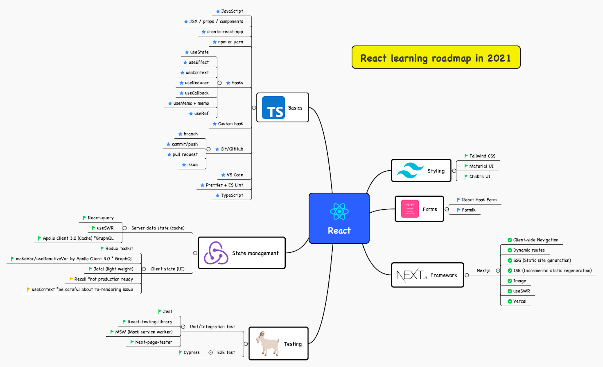

# React

<figure class="inline-flex">


</figure>

## 最上位 API

> 🔗 [React の最上位 API – React](https://ja.reactjs.org/docs/react-api.html)

- `React`
  - コンポーネント
    - `Component`
    - `PureComponent`
    - [`memo()`](https://ja.reactjs.org/docs/react-api.html#reactmemo) – コンポーネントのメモ化
  - React 要素の作成
    - `createElement()`
    - `createFactory()`
  - 要素の変換
    - `cloneElement()`
    - `isValidElement()`
    - `children`
  - フラグメント
    - `Fragment`
  - Refs
    - `createRef()`
    - `forwardRef()`
  - サスペンス
    - `lazy()` 
    - `Suspense`
  - フック
    - `useState()`
    - `useEffect()`
    - `useContext()`
    - `useReducer()`
    - `useCallback()`
    - `useMemo()`
    - `useRef()`
    - `useImperativeHandle()`
    - `useLayoutEffect()`
    - `useDebugValue()`

## フック {#hooks}

フックのルール：

- フックを呼び出すのは React の関数（**関数コンポーネント**または**カスタムフック**）のトップレベルでのみ
- フックをループや条件分岐で呼び出してはいけない

### `useState()`

> 🔗 [useState](https://ja.reactjs.org/docs/hooks-reference.html#usestate)

コンポーネント自身が持つ**状態**を扱うためのフックです。ステートフルな値と、それを更新するための関数を返します。

```tsx title="【例】useState"
import { FC, useState } from 'react';

export const Example: FC = () => {
  const [count, setCount] = useState(0);

  return (
    <div>
      <p>You clicked {count} times</p>
      <button 
        onClick={() => setCount((prevCount) => prevCount + 1)}
        {/* ⚠️アンチパターン: `setCount(count + 1);` */}
      >
        Click me
      </button>
    </div>
  );
};
```

### `useEffect()`

> 🔗 [useEffect](https://ja.reactjs.org/docs/hooks-reference.html#useeffect)

```ts title="useEffect の書き方"
import { useEffect, FC } from 'react';

const Component: FC = () => {
  useEffect(() => {
    /* 1. side-effect */
    return () => {
      /* 2. clean-up */
    };
  }, [/* 3. dependencies */]);
};
```

1. _side-effect_
  > コンポーネントがレンダーされた直後に実行される処理を記述します。
2. _clean-up_
  > コンポーネントが取り除かれた直後に実行される処理を記述します。
3. _dependencies_
  > - 省略した場合、_side-effect_ は、レンダーの度に毎回実行されます。
  > - `[]` を指定した場合、_side-effect_ は、マウント時にのみ1回だけ実行されます。
  > - `...dependencies` とした場合、_side-effect_ は、依存オブジェクトが変化した時に実行されます。

### `useContext()`

> 🔗 [useContext](https://ja.reactjs.org/docs/hooks-reference.html#usecontext)

コンテクストオブジェクト（`React.createContext` からの戻り値）を受け取り、そのコンテクストの現在値を返します。

```tsx title="【例】useContext"
import {
  FC,
  createContext,
  useContext,
  useState,
} from 'react';

const themes = {
  light: 'ライトテーマ',
  dark: 'ダークテーマ',
};

// [1] コンテキストオブジェクト
const ThemeContext = createContext(themes.light);

const App: FC = () => {
  // [3] コンテキストの現在値
  const theme = useContext(ThemeContext);
  
  return (
    <div>現在のテーマは「{theme}」です。</div>
  );
};

const AppWrapper: FC = () => {
  const [theme, setTheme] = useState(themes.light);
  
  return (
    // [2] コンテキストプロバイダー
    <ThemeContext.Provider value={theme}>
      <App />
    </ThemeContext.Provider>
  );
};
```

1. _コンテキストオブジェクト_
  > `React.createContext()` でコンテキストオブジェクトを作成します。
2. _コンテキストプロバイダー_
  > コンテキストオブジェクトの `Provider` プロパティは、コンテキストを形成するコンポーネントです。`value` 属性に共有したい値を指定します。
3. _コンテキストの現在値_
  > `useContext()` フックは、コンテキストの現在値を取得します。但し、これを呼び出すコンポーネントが指定されたコンテキストのツリー内にある必要があります。

### `useReducer()`

> 🔗 [useReducer](https://ja.reactjs.org/docs/hooks-reference.html#usereducer)

`useReducer()` は、現在の状態値を受け取り、新たな状態を返すフックで、`useState()` の変形です。

```tsx title="【構文】useReducer"
const [state, dispatch] = useReducer(reducer, initialArg, init);
```

```tsx title="【例】useReducer"
import { FC, Reducer, useReducer } from 'react';

type State = { count: number };
type Action = { type: string };

const initialState: State = { count: 0 };

const reducer: Reducer<State, Action> = (state, action) => {
  switch (action.type) {
    case 'increment':
      return { count: state.count + 1 };
    case 'decrement':
      return { count: state.count - 1 };
    default:
      throw new Error(`想定外のアクションタイプ「${action.type}」が渡されました。`);
  }
}

const Counter: FC = () => {
  const [state, dispatch] = useReducer(reducer, initialState);
  return (
    <>
      Count: {state.count}
      <button onClick={() => dispatch({ type: 'decrement' })}>-</button>
      <button onClick={() => dispatch({ type: 'increment' })}>+</button>
    </>
  );
}
```

### `useCallback()`

> 🔗 [useCallback](https://ja.reactjs.org/docs/hooks-reference.html#usecallback)

`useCallback()` は、メモ化された**コールバック**を返します。

```ts title="【構文】useCallback"
const callback = useCallback(fn, deps);
// 💡 `useCallback(fn, deps)` は `useMemo(() => fn, deps)` と等価です。
```

```ts title="【例】useCallback"
const memoizedCallback = useCallback(
  () => {
    doSomething(a, b);
  },
  [a, b],
);
```

### `useMemo()`

> 🔗 [useMemo](https://ja.reactjs.org/docs/hooks-reference.html#usememo)

`useCallback()` は、メモ化された**値**を返します。

```ts title="【例】useMemo"
// 次のようにすることで、依存配列の要素のいずれかが変化した場合にのみメモ化された値を再計算します。
const memoizedValue = useMemo(() => computeExpensiveValue(a, b), [a, b]);
```

### `useRef()`

> 🔗 [useRef](https://ja.reactjs.org/docs/hooks-reference.html#useref)

- `ref` は、DOM にアクセスする手段となります。
- `useRef` は `useState` と同様に値を保持することができます。`useRef` は値を保持することが可能ですが `useState` との違いは値を更新してもコンポーネントの再描写を**行いません**。

```tsx title="【基本的な型定義】useRef"
interface MutableRefObject<T> {
  current: T;
}

type useRef<T> = (initialValue: T) => MutableRefObject<T>;
```

:::note 【高度な内容】`initialValue` に `null` を許容した場合の型定義

ref のデフォルト値に `null` を指定すると、`current` プロパティは読み取り専用になります。

例えば、ref が `HTMLInpuElement` であり、要素に対するフォーカスをトリガーしたい場合は、`current` は読み取り専用であることの方が望ましいので、この仕様は理に適っています。

```tsx
interface RefObject<T> {
  readonly current: T | null;
}

type useRef<T> = (initialValue: T|null) => RefObject<T>;
```

:::

```tsx title="【例】useRef"
import { FC, useRef } from 'react';

const AddColorForm: FC = ({ onNewColor = (f) => f }) => {
  const txtTitle = useRef();
  const hexColor = useRef();
  
  const submit = (e) => {
    e.preventDefault();
    const title = txtTitle.current.value;
    const color = hexColor.current.value;
    onNewColor(title, color);
    txtTitle.current.value = '';
    hexColor.current.value = '';
  };
  
  return (
    <form onSubmit={submit}>
      <input ref={txtTitle} type="text" placeholder="color title..." required />
      <input ref={hexColor} type="color" required />
      <button>ADD</button>
    </form>
  );
};
```

### `useImperativeHandle()`

> 🔗 [`useImperativeHandle`](https://ja.reactjs.org/docs/hooks-reference.html#useimperativehandle)

`useImperativeHandle` は、`ref` が使われた時に親コンポーネントに渡されるインスタンス値をカスタマイズするのに、[`forwardRef`](https://ja.reactjs.org/docs/react-api.html#reactforwardref) と組み合わせて使います。

```tsx title="【構文】useImperativeHandle"
useImperativeHandle(ref, createHandle, [deps]);
```

```tsx title="【例】useImperativeHandle"
// この例では、<FancyInput ref={inputRef} /> を
// レンダーする親コンポーネントは、
// inputRef.current.focus() を呼べるようになります。
function FancyInput(props, ref) {
  const inputRef = useRef();
  useImperativeHandle(ref, () => ({
    focus: () => {
      inputRef.current.focus();
    }
  }));
  return <input ref={inputRef} />;
}
FancyInput = forwardRef(FancyInput);
```

### `useLayoutEffect()`

> 🔗 [`useLayoutEffect`](https://ja.reactjs.org/docs/hooks-reference.html#uselayouteffect)

`useuseLayoutEffect` は、[`useEffect`](#useeffect) とシグニチャは同じですが、実行されるタイミングに違いがあります：

1. コンポーネントの描画関数が呼び出される
2. `useLayoutEffect` で設定した副作用関数が呼び出される 👈
3. ブラウザーの Paint 処理（描画結果がピクセルとして画面に表示される処理）により、コンポーネントの描画結果が画面に反映される
4. `useEffect` で設定した副作用関数が呼び出される

```ts
import { FC, useState, useLayoutEffect } from 'react';

/**
 * ブラウザーウィンドウのサイズをもとにコンポーネントのサイズを計算するカスタムフック
 */
const useWindowSize = () => {
  const [width, setWidth] = useState(0);
  const [height, setHeight] = useState(0);
  
  const resize = () => {
    setWidth(window.innerWidth);
    setHeight(window.innerHeight);
  };
  
  useLayoutEffect(() => {
    window.addEventListener('resize', resize);
    resize();
    return () => window.removeEventListener('resize', resize);
  }, []);
  
  return [width, height];
};

/**
 * x と y の座標をもとにコンポーネントの位置を計算するカスタムフック
 */
const useMousePosition = () => {
  const [x, setX] = useState(0);
  const [y, setY] = useState(0);
  const setPosition = ({ x, y }) => {
    setX(x);
    setY(y);
  };
  useLayoutEffect(() => {
    window.addEventListener("mousemove", setPosition);
    return () => window.removeEventListener("mousemove", setPosition);
  }, []);
  return [x, y];
};
```

### `useDebugValue()`

> 🔗 [`useDebugValue`](https://ja.reactjs.org/docs/hooks-reference.html#usedebugvalue)

`useDebugValue` は、React DevTools で、カスタムフックのラベルを表示させるために使用します。

```tsx title="【構文】useDebugValue"
useDebugValue(value)
```

```tsx title="【例】useDebugValue"
import { useState, useDebugValue } from 'react';

function useFriendStatus(friendID) {
  const [isOnline, setIsOnline] = useState(null);

  // ...

  // Show a label in DevTools next to this Hook
  // e.g. "FriendStatus: Online"
  useDebugValue(isOnline ? 'Online' : 'Offline');

  return isOnline;
}
```

### 独自フックの作り方

> 🔗 [独自フックの作成 – React](https://ja.reactjs.org/docs/hooks-custom.html)

カスタムフックは、

- 他のフックを呼び出せる、単なる JavaScript 関数定義です。
- シグニチャの制約は一切なく、[フックのルール](#hooks)を守って際いれば、自由です。
- 組み込みフックと同じように、**`use`**という名前で始めます。

## 遅延コンポーネントとサスペンス

`Suspense` と遅延コンポーネントを用いれば、コンポーネントが非同期てロードしている間フォールバックコンポーネントをレンダリングできます。但し、現在これは SSR で利用することができません。

```tsx title="【例】lazy と Suspense"
import React, { FC, Suspense } from 'react';

const OtherComponent = React.lazy(() => import('./OtherComponent'));

const MyComponent: FC = () => {
  return (
    <div>
      <Suspense fallback={<div>Loading...</div>}>
        <OtherComponent />
      </Suspense>
    </div>
  );
};
```

## JSX と `createElement()` の対応

次の2つは同等です：

- ```tsx title="【例】JSX"
  <MyButton color="blue" shadowSize={2}>
    Click Me
  </MyButton>
  ```
- ```tsx title="【例】createElement"
  React.createElement(
    MyButton,
    { color: 'blue', shadowSize: 2 },
    'Click Me'
  )
  ```

```tsx title="【構文】createElement"
React.createElement(type, props, children)
```

## 型チェック

- Flow
- TypeScript
- propTypes

### TypeScript

```tsx
import React from 'react';

interface MyComponentProps {
  foo: string;
  bar: number;
}

const MyComponent: React.FC<MyComponentProps> = (props) => {
  // ...
  return (
    <>
      {/* ... */}
    </>
  );
};
```

### propTypes

> 🔗 [PropTypes を用いた型チェック – React](https://ja.reactjs.org/docs/typechecking-with-proptypes.html)

[`prop-types`](https://www.npmjs.com/package/prop-types) は、（パッケージは別ですが）React の組み込み型チェック機能です。

```jsx title="【例】関数コンポーネントの propTypes"
import PropTypes from 'prop-types';

function HelloWorldComponent({ name }) {
  return (
    <div>Hello, {name}</div>
  );
}

HelloWorldComponent.propTypes = {
  name: PropTypes.string,
};

export default HelloWorldComponent;
```

## `create-react-app`

> 🔗 [Repository](https://github.com/facebook/create-react-app) 🔗  [Homepage](https://create-react-app.dev/)

React プロジェクトを新規作成するためのグローバルコマンドラインユーティリティーです。

### 基本

```bash
npx create-react-app my-app
# または `npm init react-app my-app`
cd my-app
npm start
```

:::caution グローバルインストールは非推奨

`create-react-app` は、グローバルインストールでの実行がサポートされなくなりました。`npm install -g create-react-app` または `npm uninstall -g create-react-app` を実行してアンインストールしてください。

それでも `npx` 実行が失敗する場合、キャッシュを利用している可能性があります。`npx clear-npx-cache` を実行して、キャッシュの試してください。

:::

<details>
<summary>出力</summary>

```text title="プロジェクト構成"
my-app
├── README.md
├── node_modules
├── package.json
├── .gitignore
├── public
│   ├── favicon.ico
│   ├── index.html
│   ├── logo192.png
│   ├── logo512.png
│   ├── manifest.json
│   └── robots.txt
└── src
    ├── App.css
    ├── App.js
    ├── App.test.js
    ├── index.css
    ├── index.js
    ├── logo.svg
    ├── serviceWorker.js
    └── setupTests.js
```

```json title="package.json"
{
  "name": "my-app",
  "version": "0.1.0",
  "private": true,
  "dependencies": {
    "@testing-library/jest-dom": "^5.16.2",
    "@testing-library/react": "^12.1.4",
    "@testing-library/user-event": "^13.5.0",
    "react": "^17.0.2",
    "react-dom": "^17.0.2",
    "react-scripts": "5.0.0",
    "web-vitals": "^2.1.4"
  },
  "scripts": {
    "start": "react-scripts start",
    "build": "react-scripts build",
    "test": "react-scripts test",
    "eject": "react-scripts eject"
  },
  "eslintConfig": {
    "extends": [
      "react-app",
      "react-app/jest"
    ]
  },
  "browserslist": {
    "production": [
      ">0.2%",
      "not dead",
      "not op_mini all"
    ],
    "development": [
      "last 1 chrome version",
      "last 1 firefox version",
      "last 1 safari version"
    ]
  }
}
```

</details>

### テンプレート

テンプレートは、`cra-template-*` という形式の名前がつけられます。 [こちら](https://www.npmjs.com/search?q=cra-template-*) から検索できます。

```bash
npx create-react-app my-app --template [template-name]
```

- [`typescript`](https://www.npmjs.com/package/cra-template-typescript)

## アプリケーションの状態管理

- _Context API_ の利用
- サードパーティーの状態管理ライブラリの利用
  - [Redux](https://redux.js.org/)
  - [MobX](https://mobx.js.org/)

### Context API を利用した状態管理

`useContext` フックと `useReducer` フックを使用すれば、サードパーティ製のライブラリーなしで状態管理を行うことができます。

### Redux

> 🔗 [Glossary | Redux](https://redux.js.org/understanding/thinking-in-redux/glossary)

- State
- Action
- Reducer
- Dispatching Function
- Async Action
- Middleware
- Store
- Store creator
- Store enhancer

## テスト

テストで使用されるライブラリー：

- [`jest`](https://www.npmjs.com/package/jest)
- [`@testing-library/react`](https://www.npmjs.com/package/@testing-library/react)
- [`history`](https://www.npmjs.com/package/history) History API を補完するために使用されます。

### `App` のテスト

`App` コンポーネントは、`props` を受け入れず、ビジネスロジックも含まれていません。それが唯一行うことは、レイアウトをレンダリングすることです。

```tsx
import { App } from './App';
import { createMemoryHistory } from 'history'
import { render } from '@testing-library/react';
import { Router } from 'react-router-dom';

describe('App', () => {
  it('renders successfully', () => {
    const history = createMemoryHistory()
    const { container } = render(
      <Router history={history}>
        <App />
      </Router>
    )
    expect(container.innerHTML).toMatch('Text here...')
  })})
```

### ルーティングのテスト

## Tips

### パフォーマンスチューニング；不必要な再レンダリングを取り除く

再レンダリングの条件と対応方針：

1. 親コンポーネントが再レンダリングされた　👉　 `React.memo` を検討する
2. 自身に渡される _props_ が「変化」した　👉　`useCallBack` を検討
3. 自身の _state_ が「変化」した　👉　`useCallback`、`createRef` を検討

_変化_ の判断基準：

- プリミティブ: **同値性**によるチェックが行われるため、単純。（例：`'ab' === 'ab'` は `true`）
- オブジェクト: **参照同一性**によるチェックが行われるため、同じ構成でも参照が異なれば別物としてみなされます。（例：`[] === []` は `false`）

親コンポーネントが再レンダリングされたことに伴って自身も再レンダリングされます。しかし、コンポーネントが純粋関数のように、_props_ に対して**べき等**と見なすことができれば、`React.memo`でメモ化をすることにより、_props_ が変化しなかった場合、レンダリングがスキップされます。ここで、**参照同一性のチェック**に注意します。もし関数を _props_ で受け取っているなら、`useCallback` でメモ化できないか検討してみましょう。

また、自身の _state_ が変化することでも再レンダリングが行われます。再レンダリングが行われたことに反応して再度 _state_ を変化させると**無限レンダリング**が起こってしまします。そういった状況では、_state_ を _ref_ に置き換えることを検討します。_ref_ は変化しても再レンダリングが行われません。加えて、オブジェクトである _state_　を変化させている関数がメモ化する必要性も検討します。

補足として、React の将来の変更を考慮すると、`useMemo` によるメモ化は信頼性に欠けます。現在は `useCallback` と同様にメモ化を行いますが、公式から変更される可能性を示唆されています。

> useMemo はパフォーマンス最適化のために使うものであり、意味上の保証があるものだと考えないでください。
> 
> 🔗 [useMemo](https://ja.reactjs.org/docs/hooks-reference.html#usememo)


---

## 連携ライブラリー

- アプリケーション基盤
  - [React Router](https://reactrouter.com/) – ルーティング
  - [`react-helmet`](https://www.npmjs.com/package/react-helmet) – ドキュメントヘッドの管理
- 状態管理
  - [`useReducer()`](#usereducer) – 組み込みフック
  - [Redux](https://redux.js.org/) – アプリの状態管理
    - [Redux Persist](https://github.com/rt2zz/redux-persist) – Redux ストアをクライアントに永続化させます
  - [Recoil](https://recoiljs.org/) 🧪
  - [MobX](https://mobx.js.org/) – 関数型リアクティブプログラミング」による状態管理
- テスト
  - [React Testing Library](https://testing-library.com/docs/react-testing-library/intro/) – コンポーネントテスト
  - [`react-test-renderer`](https://www.npmjs.com/package/react-test-renderer) – Reactコンポーネントを純粋な JavaScript オブジェクトにレンダリング
  - [`prop-types`](https://www.npmjs.com/package/prop-types) – React prop および同様のオブジェクトのランタイムタイプチェック。
- CSS-in-JS
  - [CSS Modules](https://github.com/css-modules/css-modules)
  - [Styled Components](https://styled-system.com/(https://styled-components.com/)
  - [Styled System]
  - [Emotion](https://emotion.sh/docs/introduction)
- アニメーション
  - [React Transition Group](https://reactcommunity.org/react-transition-group/) – トランジション定義を助けるコンポーネント
  - [React Motion](https://github.com/chenglou/react-motion)
  - [React Spring](https://react-spring.io/) – spring-physics ベースのアニメーションライブラリ
  - [Framer Motion](https://framer.com/motion)
- UI
  - [MUI](https://mui.com/)
  - [Chakra UI](https://chakra-ui.com/)
  - [Rebass](https://rebassjs.org/)
- インタラクション
  - [React DnD](https://react-dnd.github.io/react-dnd/about) – ドラッグアンドドロップ
- その他
  - [Next.js](https://nextjs.org/)
  - [React Native](https://reactnative.dev/)
  - [React-pdf](https://react-pdf.org/)
  - [react-blessed](https://github.com/Yomguithereal/react-blessed) – React の [blessed.js](https://github.com/chjj/blessed) 向けのレンダラー

### ウェブ外での React

- モバイルアプリ → [React Native](https://reactnative.dev/)
- 3D → [React Three Fiber](https://github.com/Izzimach/react-three)
- ハードウェア → [React Hardware](https://github.com/iamdustan/react-hardware)

## 🚀 学習ロードマップ

