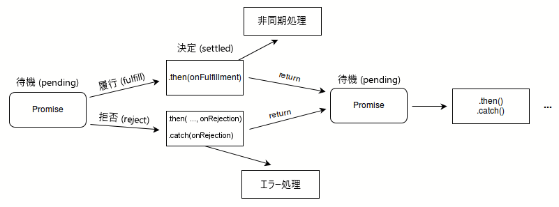

# 【JavaScript】Promise



`Promise` は非同期処理を抽象化したオブジェクトで、それを操作する仕組みです。

## 状態

`Promise` オブジェクトは、内部的に必ず次のいずれかの状態にあります：

- 待機 (pending): 初期状態。成功も失敗もしていません。
- 履行 (fulfilled): 処理が成功して完了したことを意味します。
- 拒否 (rejected): 処理が失敗したことを意味します。

## `Promise` オブジェクトの作成

### 待機状態の作成（`new Promise()`）

待機状態の `Promise` オブジェクトはコンストラクタを使用します：

```js
new Promise((resolve, reject) => {
  // ...
});
```

- `resolve` – 値とともに履行状態へ移行するための関数

  ```js title="例：成功" {2}
  new Promise((resolve, reject) => {
    resolve('success');
  });
  ```

- `reject` – 値とともに拒否状態へ移行するための関数

  ```js title="例：失敗" {2}
  new Promise((resolve, reject) => {
    reject('failed');
  });
  ```
  
  :::note `Promise` における `throw`
  
  `Promise` の中で `throw` による例外が発生した場合は自動的に `try…catch` され、その `Promise` オブジェクトは拒否状態となります。
  
  しかし、例えば、Chrome 等の開発者ツールには例外が発生した時に、デバッガーが自動で
   break する機能が用意されているため、意図した例外であるのならば、`throw` ではなく `reject` した方が良いでしょう。
  
  :::

### 履行状態の作成（`Promise.resolve()`）

```js title="例：履行状態の Promise" {2}
const value = 'Success.';
Promise.resolve(value)
    .then(val => console.log(`fulfilled >> ${val}`))
    .catch(err => console.log(`rejected >> ${err}`));
// fulfilled >> Success.
```

### 拒否状態の作成（`Promise.reject()`）

```js title="例：拒否状態の Promise" {2}
const error = new Error('Uh-oh!');
Promise.reject(error)
    .then(val => console.log(`fulfilled >> ${val}`))
    .catch(err => console.log(`rejected >> ${err}`));
// rejected >> Error: Uh-oh! 
```

## 状態変化の際の処理（`.then()`, `.catch()`, `finally()`）

状態変化後に何かを処理させるための3種類のインスタンスメソッドがあります。これらは、シグニチャごとに次のようになります：

- `then(onFulfilled)` – 履行状態

  ```js title="例：then(onFulfilled)" {3-5}
  new Promise((resolve, reject) => {
    resolve('Success!');
  }).then((value) => {
    console.log(value);
  });
  // expected output: "Success!"
  ```

- `then(onFulfilled, onRejected)` – 履行状態と拒否状態

  ```js title="例：then(onFulfilled, onRejected)" {5-9}
  new Promise((resolve, reject) => {
    resolve('Success!');
    // or
    // reject(new Error("Error!"));
  }).then(value => {
    console.log(value); // Success!
  }, reason => {
    console.error(reason); // Error!
  });
  ```

- `catch(onRejected)` – 拒否状態

  ```js title="例：catch(onRejected)" {3-5}
  new Promise((resolve, reject) => {
    throw 'Uh-oh!';
  }).catch((reason) => {
    console.error(reason);
  });
  // expected output: Uh-oh!
  ```
  
- `finally(onFinally)` – 状態変化後の最後に

  メソッドチェーンの最後に記述し、履行/拒否状態に関わらず、必ず最後に実行されます。

  ```js title="例：finally(onFinally)" {18-20}
  function checkMail() {
    return new Promise((resolve, reject) => {
      if (Math.random() > 0.5) {
        resolve('Mail has arrived');
      } else {
        reject(new Error('Failed to arrive'));
      }
    });
  }
  
  checkMail()
    .then((mail) => {
      console.log(mail);
    })
    .catch((err) => {
      console.error(err);
    })
    .finally(() => {
      console.log('Experiment completed');
    });
  /* 出力：
  Mail has arrived
  Experiment completed
  
  または
  
  Error: Failed to arrive
  Experiment completed
  */
  ```

## メソッドチェーン

`then()` や `catch()` といったインスタンスメソッドは、自身を返すため、メソッドチェーンが可能です。

`catch()` の後にチェーンを継続することもできます：

```js title="例：Promise チェーン" {2,12,15}
new Promise((resolve, reject) => {
    console.log('Initial');

    resolve();
})
.then(() => {
    throw new Error('Something failed');

    console.log('Do this');
})
.catch(() => {
    console.error('Do that');
})
.then(() => {
    console.log('Do this, no matter what happened before');
});
/* 出力：
Initial
Do that
Do this, no matter what happened before
*/
```

## 複数の `Promise` オブジェクトの合成

### `Promise.all()`

:::note 概要

`Promise.all()` は、`Promise` のリストを定義し、それらがすべて解決されたときに何かを実行するのに役立ちます。

- 履行状態への変化

  **全て**が履行状態となった時点で、それら全ての結果値を配列で持ちます。

- 拒否状態への変化

  **いずれか**が拒否状態となった時点で、その単一の結果値を持ちます。

:::

### `Promise.any()`

:::note 概要

`Promise.any()` は、渡した `Promise` のいずれかが実行されるか、すべての約束が拒否されたときに解決します。実行された最初の `Promise` の値で解決される単一の `Promise` を返します。すべての `Promise` が拒否された場合、返された `Promise` は `AggregateError` で拒否されます。

- 履行状態への変化

  **いずれか**が履行状態となった時点で、その単一の結果値を持ちます。

- 拒否状態への変化

  全てが拒否状態となった時点で、その [`AggregateError`](https://developer.mozilla.org/ja/docs/Web/JavaScript/Reference/Global_Objects/AggregateError) を持ちます。

:::

### `Promise.race()`

:::note 概要

`Promise.race()` は、渡された最初の `Promise` が解決（解決または拒否）したときに実行され、接続されたコールバックを1回だけ実行して、**最初の** `Promise` の結果が解決します。

- 履行状態への変化

  **いずれか**が履行状態となった時点で、その単一の結果値を持ちます。

- 拒否状態への変化

  **いずれか**が拒否状態となった時点で、その単一の結果値を持ちます。

:::

## 複数の `Promise` の完了を確認する（`Promise.allSettled()`）

:::note 概要

`Promise.allSettled()` メソッドは、与えられたすべてのプロミスが完了した後に、それらのプロミスの_結果を記述したオブジェクト_の配列を返します。

このオブジェクトの構成は次の通りです：

- _履行状態の場合_
  - `status` – 文字列 `'fulfilled'`
  - `value`
- _拒否状態の場合_
  - `status` – 文字列 `'rejected'`
  - `reason`

:::

## `Promise` のイベント