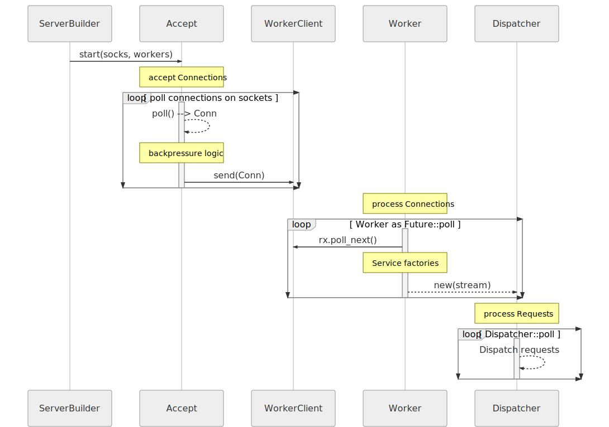
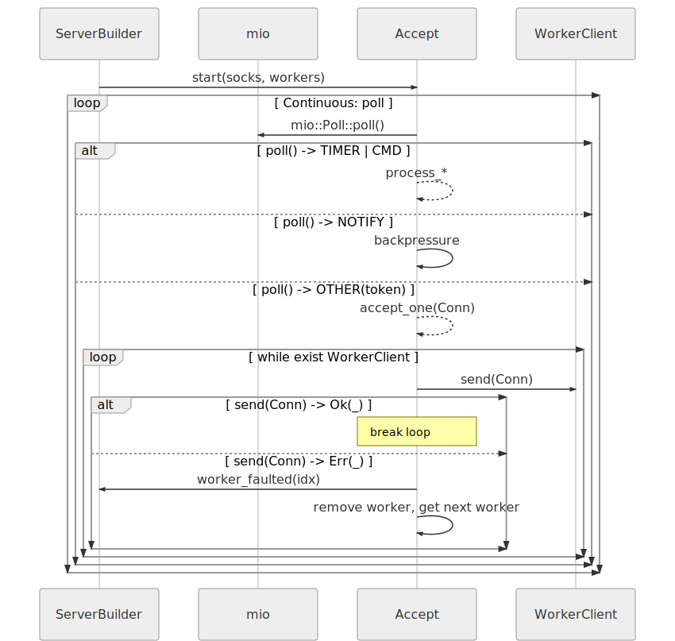
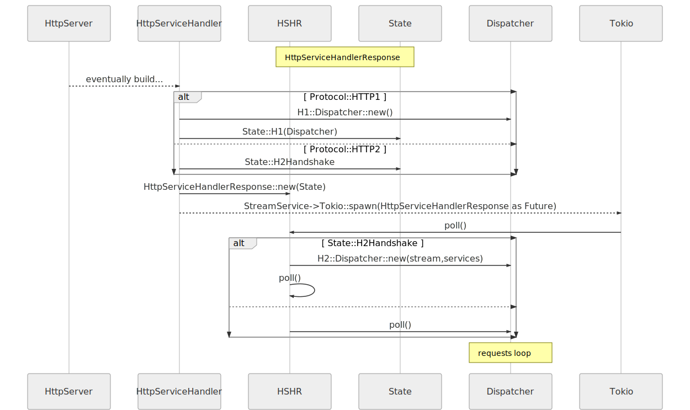

# 【Rust】クレート `actix_web`

<figure class="inline-flex bg-white">


</figure>

[`actix_web`](https://docs.rs/actix-web/) は、Rust における高速な Web フレームワークです。

当初、`actix-web` は、強力で高速なアクターシステムである `actix` 上に構築されました。しかし現在では、`actix-web` はアクターフレームワークとはほとんど関係がなく、別のシステムを使用して構築されています。現時点では WebSocket のエンドポイントでのみ `actix` を必要とします。

## 公開メンバー

- _再エクスポート_
  - `cookie` — [`actix_http::cookie`](https://docs.rs/cookie/*/cookie/index.html)
  - `rt` — [`actix_rt`](https://docs.rs/actix-rt/*/actix_rt/index.html)
- _モジュール_
  - [`body`](https://docs.rs/actix-web/3/actix_web/body/index.html)
  - [`client`](https://docs.rs/actix-web/3/actix_web/client/index.html) — Actix web 非同期 HTTP クライアント。
  - [`dev`](https://docs.rs/actix-web/3/actix_web/dev/index.html) — ライブラリ開発者向けの `actix-web` プレリュード
  - [`error`](https://docs.rs/actix-web/3/actix_web/error/index.html) — エラーと結果モジュール
  - [`guard`](https://docs.rs/actix-web/3/actix_web/guard/index.html) — ルートマッチガード。
  - [`http`](https://docs.rs/actix-web/3/actix_web/http/index.html) — さまざまなHTTP関連の型
  - [`middleware`](https://docs.rs/actix-web/3/actix_web/middleware/index.html) — ミドルウェア
  - [`test`](https://docs.rs/actix-web/3/actix_web/test/index.html) — テスト中に使用する Actix アプリケーションのさまざまなヘルパー。
  - [`web`](https://docs.rs/actix-web/3/actix_web/web/index.html) — アプリケーション登録のための Essential sヘルパー関数と型。

- _構造体_
  - [`App`](https://docs.rs/actix-web/3/actix_web/struct.App.html) — アプリケーションビルダー-アプリケーションインスタンスを構築するためのビルダーパターンに従う構造。
  - [`Error`](https://docs.rs/actix-web/3/actix_web/struct.Error.html) — 一般的な actix web エラー。
  - [`HttpRequest`](https://docs.rs/actix-web/3/actix_web/struct.HttpRequest.html) — HTTP リクエスト
  - [`HttpResponse`](https://docs.rs/actix-web/3/actix_web/struct.HttpResponse.html) — HTTP レスポンス
  - [`HttpServer`](https://docs.rs/actix-web/3/actix_web/struct.HttpServer.html) — HTTP サーバー
  - [`Resource`](https://docs.rs/actix-web/3/actix_web/struct.Resource.html) — 要求されたURLに対応するリソーステーブルのエントリ
  - [`Route`](https://docs.rs/actix-web/3/actix_web/struct.Route.html) — リソースルートの定義
  - [`Scope`](https://docs.rs/actix-web/3/actix_web/struct.Scope.html) — リソーススコープ。
- _列挙型_
  - [`Either`](https://docs.rs/actix-web/3/actix_web/enum.Either.html) — 2つの異なるレスポンダー型を1つの型に結合します
  - [`EitherExtractError`](https://docs.rs/actix-web/3/actix_web/enum.EitherExtractError.html) — `Either<A, B>` の抽出に失敗したために発生した複合エラー。
- _トレイト_
  - [`FromRequest`](https://docs.rs/actix-web/3/actix_web/trait.FromRequest.html) — リクエストから抽出できる型によって実装されるトレイト。
  - [`HttpMessage`](https://docs.rs/actix-web/3/actix_web/trait.HttpMessage.html) — http メッセージに対して汎用的な操作を実装するトレイト
  - [`Responder`](https://docs.rs/actix-web/3/actix_web/trait.Responder.html) — http レスポンスに変換できる型によって実装されるトレイト。
  - [`ResponseError`](https://docs.rs/actix-web/3/actix_web/trait.ResponseError.html) — `Response` に変換できるエラー
- _型定義_
  - [`Result`](https://docs.rs/actix-web/3/actix_web/type.Result.html) — actix web 操作の特殊な [`Result`](https://doc.rust-lang.org/std/result/enum.Result.html)
- _属性マクロ_
  - [`connect`](https://docs.rs/actix-web/3/actix_web/attr.connect.html) — `actix_web::guard::Connect` を使用してルートハンドラーを作成します。
  - [`delete`](https://docs.rs/actix-web/3/actix_web/attr.delete.html) — `actix_web::guard::Delete` を使用してルートハンドラーを作成します。
  - [`get`](https://docs.rs/actix-web/3/actix_web/attr.get.html) — `actix_web::guard::Get` を使用してルートハンドラーを作成します。
  - [`head`](https://docs.rs/actix-web/3/actix_web/attr.head.html) — `actix_web::guard::Head` を使用してルートハンドラーを作成します。
  - [`main`](https://docs.rs/actix-web/3/actix_web/attr.main.html) — 非同期 `main` 関数を actix システムのエントリポイントとしてマークします。
  - [`options`](https://docs.rs/actix-web/3/actix_web/attr.options.html) — `actix_web::guard::Options` を使用してルートハンドラーを作成します。
  - [`patch`](https://docs.rs/actix-web/3/actix_web/attr.patch.html) — `actix_web::guard::Patch` を使用してルートハンドラーを作成します。
  - [`post`](https://docs.rs/actix-web/3/actix_web/attr.post.html) — `actix_web::guard::Post` を使用してルートハンドラーを作成します。
  - [`put`](https://docs.rs/actix-web/3/actix_web/attr.put.html) — `actix_web::guard::Put` を使用してルートハンドラーを作成します。
  - [`route`](https://docs.rs/actix-web/3/actix_web/attr.route.html) — リソースハンドラーを作成し、複数のHTTPメソッドガードを許可します。
  - [`trace`](https://docs.rs/actix-web/3/actix_web/attr.trace.html) — `actix_web::guard::Trace` を使用してルートハンドラーを作成します。

## 基本

### Hello, world!

**リクエストハンドラー** は、0個以上のパラメーターを受け入れる非同期関数を使用します。これらのパラメーターは、リクエストから抽出でき（[`FromRequest`](https://docs.rs/actix-web/3/actix_web/trait.FromRequest.html) トレイト）、[`HttpResponse`](https://docs.rs/actix-web/3/actix_web/struct.HttpResponse.html) に変換できる型を返します（[`Responder`](https://docs.rs/actix-web/3/actix_web/trait.Responder.html) トレイト）：

```rust
use actix_web::{get, post, web, App, HttpResponse, HttpServer, Responder};

#[get("/")]
async fn hello() -> impl Responder {
    HttpResponse::Ok().body("Hello world!")
}

#[post("/echo")]
async fn echo(req_body: String) -> impl Responder {
    HttpResponse::Ok().body(req_body)
}

async fn manual_hello() -> impl Responder {
    HttpResponse::Ok().body("Hey there!")
}

#[actix_web::main]
async fn main() -> std::io::Result<()> {
    HttpServer::new(|| {
        App::new()
            .service(hello)
            .service(echo)
            .route("/hey", web::get().to(manual_hello))
    })
    .bind("127.0.0.1:8080")?
    .run()
    .await
}
```

### アプリケーションの作成

すべての `actix-web` サーバーは、[`App`](https://docs.rs/actix-web/3/actix_web/struct.App.html) インスタンスを中心に構築されています。

アプリケーションの [`scope`](https://docs.rs/actix-web/3/actix_web/struct.Scope.html) は、すべてのルートの名前空間として機能します。つまり、特定のアプリケーションスコープのすべてのルートには、同じ URL パスプレフィックスが付いています。アプリケーションプレフィックスには、常に先頭の「`/`」が含まれます。指定されたプレフィックスに先頭のスラッシュが含まれていない場合は、自動的に挿入されます。プレフィックスは、値パスセグメントで構成されている必要があります。

スコープが `/app` のアプリケーションの場合、パスが `/app`、`/app/`、または `/app/test` のリクエストはすべて一致します。ただし、パス `/application` は一致しません。

```rust {10-15}
use actix_web::{web, App, HttpServer, Responder};

async fn index() -> impl Responder {
    "Hello world!"
}

#[actix_web::main]
async fn main() -> std::io::Result<()> {
    HttpServer::new(|| {
        App::new().service(
            // それに接続されているすべてのリソースとルートのプレフィックス...
            web::scope("/app")
                // ...したがって、これは `GET /app/index.html` のリクエストを処理します
                .route("/index.html", web::get().to(index)),
        )
    })
    .bind("127.0.0.1:8080")?
    .run()
    .await
}
```

#### 状態

アプリケーションの状態は、同じスコープ内のすべてのルートとリソースで共有されます。状態には、[`web::Data<T>`](https://docs.rs/actix-web/3/actix_web/web/struct.Data.html) エクストラクタを使用してアクセスできます。ここで、`T` は状態の型です。ミドルウェアでも状態にアクセスできます。

簡単なアプリケーションを作成し、アプリケーション名を次の状態で保存しましょう：

```rust {3-6}
use actix_web::{get, web, App, HttpServer};

// この構造体は状態を表します
struct AppState {
    app_name: String,
}

#[get("/")]
async fn index(data: web::Data<AppState>) -> String {
    let app_name = &data.app_name; // <- app_name を取得します

    format!("Hello {}!", app_name) // <- app_name によるレスポンス
}
```

次に、アプリを初期化するときの状態を渡し、アプリケーションを起動します：

```rust {5-7}
#[actix_web::main]
async fn main() -> std::io::Result<()> {
    HttpServer::new(|| {
        App::new()
            .data(AppState {
                app_name: String::from("Actix-web"),
            })
            .service(index)
    })
    .bind("127.0.0.1:8080")?
    .run()
    .await
}
```

アプリケーション内には、任意の数の状態型を登録できます。

#### 共有された可変状態 {#shared-mutable-state}

`HttpServer` は、アプリケーションインスタンスではなく、アプリケーションファクトリを受け入れます。 `HttpServer` は、スレッドごとにアプリケーションインスタンスを構築します。したがって、アプリケーションデータは複数回作成する必要があります。異なるスレッド間でデータを共有したい場合は、`Send + Sync` など、共有可能なオブジェクトを使用する必要があります。

内部的には、[`web::Data`](https://docs.rs/actix-web/3/actix_web/web/struct.Data.html) は `Arc` を使用します。したがって、2つの `Arc` の作成を回避するには、[`App::app_data()`](https://docs.rs/actix-web/3/actix_web/struct.App.html#method.app_data) を使用してデータを登録する前にデータを作成する必要があります。

次の例では、変更可能な共有状態のアプリケーションを作成します。まず、状態を定義し、ハンドラーを作成します：

```rust
use actix_web::{web, App, HttpServer};
use std::sync::Mutex;

struct AppStateWithCounter {
    counter: Mutex<i32>, // <- スレッド間で安全に変更するには、Mutex が必要です
}

async fn index(data: web::Data<AppStateWithCounter>) -> String {
    let mut counter = data.counter.lock().unwrap(); // <- カウンターの MutexGuard を取得します
    *counter += 1; // <- MutexGuard 内のアクセスカウンター

    format!("Request number: {}", counter) // <- カウント付きのレスポンス
}
```

そして `App` にデータを登録します：

```rust
#[actix_web::main]
async fn main() -> std::io::Result<()> {
    let counter = web::Data::new(AppStateWithCounter {
        counter: Mutex::new(0),
    });

    HttpServer::new(move || {
        // カウンターをクロージャーに移動します
        App::new()
            // 注：データの代わりに app_data を使用する
            .app_data(counter.clone()) // <- 作成したデータを登録する
            .route("/", web::get().to(index))
    })
    .bind("127.0.0.1:8080")?
    .run()
    .await
}
```

#### アプリケーションスコープを使用したアプリケーションの作成

[`web::scope()`](https://docs.rs/actix-web/3/actix_web/web/fn.scope.html) メソッドを使用すると、リソースグループのプレフィックスを設定できます。このスコープは、リソース構成によって追加されたすべてのリソースパターンの前に付加されるリソースプレフィックスを表します。これは、同じリソース名を維持しながら、元の作成者が意図したものとは異なる場所に一連のルートをマウントするのに役立ちます。

例えば：

```rust
#[actix_web::main]
async fn main() {
    let scope = web::scope("/users").service(show_users);
    App::new().service(scope);
}
```

上記の例では、アプリケーションのスコープ引数がパターンの前に付加されるため、`show_users` ルートの有効なルートパターンは `/show` ではなく `/users/show` になります。この場合、ルートは URL パスが `/users/show` の場合にのみ一致し、[`HttpRequest.url_for()`](https://docs.rs/actix-web/3/actix_web/struct.HttpRequest.html#method.url_for) 関数がルート名 `show_users` で呼び出されると、同じパスの URL が生成されます。

#### アプリケーションガードと仮想ホスティング

ガードは、リクエストオブジェクトの参照を受け入れ、`true` または `false` を返す単純な関数と考えることができます。正式には、ガードは [`Guard`](https://docs.rs/actix-web/3/actix_web/guard/trait.Guard.html) トレイトを実装するオブジェクトです。 Actix-web はいくつかのガードを提供します。 API ドキュメントの [関数セクション](https://docs.rs/actix-web/3/actix_web/guard/index.html#functions) を確認できます。

提供されているガードの1つは [`Header`](https://docs.rs/actix-web/3/actix_web/guard/fn.Header.html) です。リクエストヘッダー情報に基づくフィルターとして使用できます。

```rust
#[actix_web::main]
async fn main() -> std::io::Result<()> {
    HttpServer::new(|| {
        App::new()
            .service(
                web::scope("/")
                    .guard(guard::Header("Host", "www.rust-lang.org"))
                    .route("", web::to(|| HttpResponse::Ok().body("www"))),
            )
            .service(
                web::scope("/")
                    .guard(guard::Header("Host", "users.rust-lang.org"))
                    .route("", web::to(|| HttpResponse::Ok().body("user"))),
            )
            .route("/", web::to(|| HttpResponse::Ok()))
    })
    .bind("127.0.0.1:8080")?
    .run()
    .await
}
```

#### 構成

単純さと再利用性のために、[`App`](https://docs.rs/actix-web/3/actix_web/struct.App.html#method.configure)　と　[`web::Scope`](https://docs.rs/actix-web/3/actix_web/struct.Scope.html#method.configure)　の両方が　`configure`　メソッドを提供します。この関数は、構成の一部を別のモジュールまたはライブラリに移動する場合に役立ちます。たとえば、リソースの構成の一部を別のモジュールに移動できます。

```rust
use actix_web::{web, App, HttpResponse, HttpServer};

// この関数は別のモジュールに配置できます
fn scoped_config(cfg: &mut web::ServiceConfig) {
    cfg.service(
        web::resource("/test")
            .route(web::get().to(|| HttpResponse::Ok().body("test")))
            .route(web::head().to(|| HttpResponse::MethodNotAllowed())),
    );
}

// この関数は別のモジュールに配置できます
fn config(cfg: &mut web::ServiceConfig) {
    cfg.service(
        web::resource("/app")
            .route(web::get().to(|| HttpResponse::Ok().body("app")))
            .route(web::head().to(|| HttpResponse::MethodNotAllowed())),
    );
}

#[actix_web::main]
async fn main() -> std::io::Result<()> {
    HttpServer::new(|| {
        App::new()
            .configure(config)
            .service(web::scope("/nodejs-api").configure(scoped_config))
            .route("/", web::get().to(|| HttpResponse::Ok().body("/")))
    })
    .bind("127.0.0.1:8080")?
    .run()
    .await
}
```

上記の例の結果は次のようになります：

```
/         -> "/"
/app      -> "app"
/api/test -> "test"
```

各 [`ServiceConfig`](https://docs.rs/actix-web/3/actix_web/web/struct.ServiceConfig.html) は、独自の`data`、`route`、および `services` を持つことができます。

### HTTP サーバー

[`HttpServer`](https://docs.rs/actix-web/3/actix_web/struct.HttpServer.html) は、HTTP リクエストに対してサービスを提供する責任があります。

`HttpServer` は、アプリケーションファクトリをパラメータとして受け入れ、アプリケーションファクトリには `Send + Sync` の境界が必要です。詳細については、マルチスレッドのセクションをご覧ください。

特定のソケットアドレスにバインドするには、[`bind()`](https://docs.rs/actix-web/3/actix_web/struct.HttpServer.html#method.bind) を使用する必要があり、複数回呼び出される場合があります。 ssl ソケットをバインドするには、[`bind_openssl()`](https://docs.rs/actix-web/3/actix_web/struct.HttpServer.html#method.bind_openssl) または [`bind_rustls()`](https://docs.rs/actix-web/3/actix_web/struct.HttpServer.html#method.bind_rustls) を使用する必要があります。 HTTP サーバーを実行するには、`HttpServer::run()` メソッドを使用します。

```rust
use actix_web::{web, App, HttpResponse, HttpServer};

#[actix_web::main]
async fn main() -> std::io::Result<()> {
    HttpServer::new(|| {
        App::new().route("/", web::get().to(|| HttpResponse::Ok()))
    })
    .bind("127.0.0.1:8080")?
    .run()
    .await
}
```

`run()` メソッドは、サーバータイプのインスタンスを返します。`Server` 型のメソッドは、HTTP サーバーの管理に使用できます

- `pause()` — 着信接続の受け入れを一時停止します
- `resume()` — 着信接続の受け入れを再開します
- `stop()` — 着信接続処理を停止し、すべてのワーカーを停止して終了します

次の例は、HTTPサーバーを別のスレッドで起動する方法を示しています：

```rust
use actix_web::{rt::System, web, App, HttpResponse, HttpServer};
use std::sync::mpsc;
use std::thread;

#[actix_web::main]
async fn main() {
    let (tx, rx) = mpsc::channel();

    thread::spawn(move || {
        let sys = System::new("http-server");

        let srv = HttpServer::new(|| {
            App::new().route("/", web::get().to(|| HttpResponse::Ok()))
        })
        .bind("127.0.0.1:8080")?
        .shutdown_timeout(60) // <- シャットダウンタイムアウトを60秒に設定します
        .run();

        let _ = tx.send(srv);
        sys.run()
    });

    let srv = rx.recv().unwrap();

    // 新しい接続の受け入れを一時停止します
    srv.pause().await;
    // 新しい接続の受け入れを再開します
    srv.resume().await;
    // サーバーを停止します
    srv.stop(true).await;
}
```

#### マルチスレッド

`HttpServer` は自動的に多数の HTTP ワーカーを開始します。デフォルトでは、この数はシステム内の論理 CPU の数と同じです。この数は、[`HttpServer::worker()`](https://docs.rs/actix-web/3/actix_web/struct.HttpServer.html#method.workers) メソッドで上書きできます。

```rust
use actix_web::{web, App, HttpResponse, HttpServer};

#[actix_web::main]
async fn main() {
    HttpServer::new(|| {
        App::new().route("/", web::get().to(|| HttpResponse::Ok()))
    })
    .workers(4); // <- Start 4 workers
}
```

ワーカーが作成されると、ワーカーはそれぞれ個別のアプリケーションインスタンスを受け取り、リクエストを処理します。アプリケーションの状態はスレッド間で共有されず、ハンドラーは同時実行の心配なしに状態のコピーを自由に操作できます。

アプリケーションの状態は `Send` または `Sync` である必要はありませんが、アプリケーションファクトリは `Send + Sync` である必要があります。

ワーカースレッド間で状態を共有するには、`Arc` を使用します。共有と同期が導入されたら、特別な注意を払う必要があります。多くの場合、変更のために共有状態をロックした結果として、パフォーマンスコストが誤って導入されます。

場合によっては、[`Mutex`](https://doc.rust-lang.org/std/sync/struct.Mutex.html) の代わりに [読み取り/書き込みロック](https://doc.rust-lang.org/std/sync/struct.RwLock.html) を使用して非排他的ロックを実現するなど、より効率的なロック戦略を使用してこれらのコストを軽減できますが、最もパフォーマンスの高い実装は、ロックがまったく発生しない実装であることがよくあります。

各ワーカースレッドはその要求を順番に処理するため、現在のスレッドをブロックするハンドラーにより、現在のワーカーは新しい要求の処理を停止します：

```rust title="悪い例"
fn my_handler() -> impl Responder {
    std::thread::sleep(Duration::from_secs(5)); // <-- Bad プラクティス！現在のワーカースレッドがハングします！
    "response"
}
```

このため、CPU にバインドされていない長い操作（I/O、データベース操作など）は、future または非同期関数として表現する必要があります。非同期ハンドラーはワーカースレッドによって同時に実行されるため、実行をブロックしません：

```rust title="良い例"
async fn my_handler() -> impl Responder {
    tokio::time::delay_for(Duration::from_secs(5)).await; // <-- Ok. ワーカースレッドはここで他のリクエストを処理します
    "response"
}
```

同じ制限がエクストラクタにも適用されます。ハンドラー関数が `FromRequest` を実装する引数を受け取り、その実装が現在のスレッドをブロックすると、ハンドラーの実行時にワーカースレッドがブロックします。このため、エクストラクタを実装する場合は特別な注意を払う必要があります。また、必要に応じて非同期で実装する必要があります。

#### SSL

SSL サーバーには、`rustls` と `openssl` の2つの機能があります。 `rustls` 機能は `rustls` 統合用であり、`openssl` は `openssl` 用です。

```toml
[dependencies]
actix-web = { version = "3", features = ["openssl"] }
openssl = { version = "0.10" }
```

```rust
use actix_web::{get, App, HttpRequest, HttpServer, Responder};
use openssl::ssl::{SslAcceptor, SslFiletype, SslMethod};

#[get("/")]
async fn index(_req: HttpRequest) -> impl Responder {
    "Welcome!"
}

#[actix_web::main]
async fn main() -> std::io::Result<()> {
    // load ssl keys
    // to create a self-signed temporary cert for testing:
    // `openssl req -x509 -newkey rsa:4096 -nodes -keyout key.pem -out cert.pem -days 365 -subj '/CN=localhost'`
    let mut builder =
        SslAcceptor::mozilla_intermediate(SslMethod::tls()).unwrap();
    builder
        .set_private_key_file("key.pem", SslFiletype::PEM)
        .unwrap();
    builder.set_certificate_chain_file("cert.pem").unwrap();

    HttpServer::new(|| App::new().service(index))
        .bind_openssl("127.0.0.1:8080", builder)?
        .run()
        .await
}
```

**注**：HTTP/2.0 プロトコルには [tls alpn](https://tools.ietf.org/html/rfc7301) が必要です。現時点では、`openssl` のみが `alpn` をサポートしています。完全な例については、[examples/openssl](https://github.com/actix/examples/tree/master/security/openssl) を確認してください。

`key.pem` および `cert.pem` を作成するには、コマンドを使用します。あなた自身の主題を記入してください

```bash
$ openssl req -x509 -newkey rsa:4096 -keyout key.pem -out cert.pem \
  -days 365 -sha256 -subj "/C=CN/ST=Fujian/L=Xiamen/O=TVlinux/OU=Org/CN=muro.lxd"
```

パスワードを削除するには、`nopass.pem` を `key.pem` にコピーします

```bash
$ openssl rsa -in key.pem -out nopass.pem
```

#### Keep-Alive

Actixは、keep-alive 接続で要求を待機できます。

keep-alive 接続の動作は、サーバー設定によって定義されます。

- `75`, `Some(75)`, `KeepAlive::Timeout(75)` — 75秒の _keep alive_ タイマーを有効にします。
- `None` または `KeepAlive::Disabled` — _keep alive_ を無効にします。
- `KeepAlive::Tcp(75)` — `SO_KEEPALIVE` ソケットオプションを使用します。

```rust
use actix_web::{web, App, HttpResponse, HttpServer};

#[actix_web::main]
async fn main() -> std::io::Result<()> {
    let one = HttpServer::new(|| {
        App::new().route("/", web::get().to(|| HttpResponse::Ok()))
    })
    .keep_alive(75); // <- keep-alive を 75 秒に設定する

    // let _two = HttpServer::new(|| {
    //     App::new().route("/", web::get().to(|| HttpResponse::Ok()))
    // })
    // .keep_alive(); // <- `SO_KEEPALIVE` ソケットオプションを使用する。

    let _three = HttpServer::new(|| {
        App::new().route("/", web::get().to(|| HttpResponse::Ok()))
    })
    .keep_alive(None); // <- keep-alive を無効にする

    one.bind("127.0.0.1:8080")?.run().await
}
```

上記の最初のオプションが選択されている場合、キープアライブ状態は応答の接続タイプに基づいて計算されます。デフォルトでは、HttpResponse :: connection_typeは定義されていません。その場合、keepaliveはリクエストのHTTPバージョンによって定義されます。

keep alive は、_HTTP/1.0_ の場合はオフで、_HTTP/1.1_ および _HTTP/2.0_ の場合はオンです。

接続タイプは、`HttpResponseBuilder::connection_type()` メソッドを使用して変更できます。

```rust
use actix_web::{http, HttpRequest, HttpResponse};

async fn index(req: HttpRequest) -> HttpResponse {
    HttpResponse::Ok()
        .connection_type(http::ConnectionType::Close) // <- 接続を閉じる
        .force_close() // <- 別の方法
        .finish()
}
```

#### 優雅なシャットダウン

`HttpServer` は正常なシャットダウンをサポートします。停止信号を受信した後、ワーカーはリクエストの処理を完了するために特定の時間があります。タイムアウト後もまだ生きているワーカーは強制的にドロップされます。デフォルトでは、シャットダウンタイムアウトは30秒に設定されています。このパラメーターは、[`HttpServer::shutdown_timeout()`](https://docs.rs/actix-web/3/actix_web/struct.HttpServer.html#method.shutdown_timeout) メソッドを使用して変更できます。

`HttpServer` はいくつかの OS 信号を処理します。_CTRL-C_ はすべての OS で使用でき、他の信号は UNIX システムで使用できます。

- _SIGINT_ — 強制シャットダウンワーカー
- _SIGTERM_ — 優雅なシャットダウンワーカー
- _SIGOUT_ — 強制シャットダウンワーカー

[`HttpServer::disable_signals()`](https://docs.rs/actix-web/3/actix_web/struct.HttpServer.html#method.disable_signals) メソッドを使用して信号処理を無効にすることができます。

### リクエストハンドラー

リクエストハンドラーは、リクエストから抽出できる0個以上のパラメーター（つまり、[`impl FromRequest`](https://docs.rs/actix-web/3/actix_web/trait.FromRequest.html)）を受け入れ、[`HttpResponse`](https://docs.rs/actix-web/3/actix_web/struct.HttpResponse.html) に変換できる型（つまり、[`impl Responder`](https://docs.rs/actix-web/3/actix_web/trait.Responder.html)）を返す非同期関数です。

リクエストの処理は2段階で行われます。最初にハンドラーオブジェクトが呼び出され、[`Responder`](https://docs.rs/actix-web/3/actix_web/trait.Responder.html) トレイトを実装するオブジェクトが返されます。次に、返されたオブジェクトで `respond_to()` が呼び出され、それ自体が `HttpResponse` または `Error` に変換されます。

デフォルトでは、actix-web は、`&'static str`、`String` などのいくつかの標準型の `Responder` 実装を提供します。

実装の完全なリストについては、[`Responder` のドキュメント](https://docs.rs/actix-web/3/actix_web/trait.Responder.html#foreign-impls) を確認してください。

有効なハンドラーの例：

```rust
async fn index(_req: HttpRequest) -> &'static str {
    "Hello world!"
}
```

```rust
async fn index(_req: HttpRequest) -> String {
    "Hello world!".to_owned()
}
```

シグニチャを変更して、より複雑なタイプが含まれる場合に適切に機能する `impl Responder` を返すこともできます。

```rust
async fn index(_req: HttpRequest) -> impl Responder {
    web::Bytes::from_static(b"Hello world!")
}
```

```rust
async fn index(req: HttpRequest) -> Box<Future<Item=HttpResponse, Error=Error>> {
    // ...
}
```

#### カスタム型でのレスポンス

ハンドラー関数からカスタム型を直接返すには、型は `Responder` トレイトを実装する必要があります。

`application/json` レスポンスにシリアル化するカスタムタイプの応答を作成しましょう：

```rust
use actix_web::{Error, HttpRequest, HttpResponse, Responder};
use futures::future::{ready, Ready};
use serde::Serialize;

#[derive(Serialize)]
struct MyObj {
    name: &'static str,
}

// Responder
impl Responder for MyObj {
    type Error = Error;
    type Future = Ready<Result<HttpResponse, Error>>;

    fn respond_to(self, _req: &HttpRequest) -> Self::Future {
        let body = serde_json::to_string(&self).unwrap();

        // Create response and set content type
        ready(Ok(HttpResponse::Ok()
            .content_type("application/json")
            .body(body)))
    }
}

async fn index() -> impl Responder {
    MyObj { name: "user" }
}
```

#### ストリーミングレスポンスボディ

レスポンスボディは非同期で生成できます。この場合、ボディはストリームトレイト `Stream <Item=Bytes, Error=Error>` を実装する必要があります。つまり：

```rust
use actix_web::{get, web, App, Error, HttpResponse, HttpServer};
use futures::{future::ok, stream::once};

#[get("/stream")]
async fn stream() -> HttpResponse {
    let body = once(ok::<_, Error>(web::Bytes::from_static(b"test")));

    HttpResponse::Ok()
        .content_type("application/json")
        .streaming(body)
}

#[actix_web::main]
async fn main() -> std::io::Result<()> {
    HttpServer::new(|| App::new().service(stream))
        .bind("127.0.0.1:8080")?
        .run()
        .await
}
```

#### 異なる返り値型（`Either`）

場合によっては、異なる型のレスポンスを返す必要があります。たとえば、エラーチェックしてエラーを返したり、非同期レスポンスを返したり、2つの異なる型を必要とする `Result` を返したりすることができます。

この場合、[`Either`](https://docs.rs/actix-web/3/actix_web/enum.Either.html) 型を使用できます。どちらも、2つの異なる `Responder` 型を1つの型に組み合わせることができます。

```rust
use actix_web::{Either, Error, HttpResponse};

type RegisterResult = Either<HttpResponse, Result<&'static str, Error>>;

async fn index() -> RegisterResult {
    if is_a_variant() {
        // <- バリアントA を選択
        Either::A(HttpResponse::BadRequest().body("Bad data"))
    } else {
        // <- バリアントB
        Either::B(Ok("Hello!"))
    }
}
```

### エクストラクタ {#extractors}

Actix-web は、エクストラクタ（つまり、`impl FromRequest`）と呼ばれる型安全なリクエスト情報アクセスのための機能を提供します。デフォルトでは、actix-web はいくつかのエクストラクタ実装を提供します。

エクストラクタは、ハンドラー関数の引数としてアクセスできます。Actix-web は、ハンドラー関数ごとに最大12個のエクストラクタをサポートします。引数の位置は関係ありません。

```rust
async fn index(path: web::Path<(String, String)>, json: web::Json<MyInfo>) -> impl Responder {
    let path = path.into_inner();
    format!("{} {} {} {}", path.0, path.1, json.id, json.username)
}
```

#### パス

[`Path`](https://docs.rs/actix-web/3/actix_web/dev/struct.Path.html) は、リクエストのパスから抽出できる情報を提供します。パスから任意の変数セグメントを逆シリアル化できます。

たとえば、`/users/{user_id}/{friend}` パスに登録されたリソースの場合、`user_id` と `friend` の2つのセグメントを逆シリアル化できます。これらのセグメントは、`touple`、つまり `Path<(u32、String)>` または _serde_ クレートからの `Deserialize` トレイトを実装する任意の構造に抽出できます。

```rust
use actix_web::{get, web, Result};

/// 「/users/{user_id}/{friend}」URL からパス情報を抽出します
/// {user_id} - u32 に逆シリアル化します
/// {friend} - String に逆シリアル化します
#[get("/users/{user_id}/{friend}")] // <- パスパラメータを定義する
async fn index(web::Path((user_id, friend)): web::Path<(u32, String)>) -> Result<String> {
    Ok(format!("Welcome {}, user_id {}!", friend, user_id))
}

#[actix_web::main]
async fn main() -> std::io::Result<()> {
    use actix_web::{App, HttpServer};

    HttpServer::new(|| App::new().service(index))
        .bind("127.0.0.1:8080")?
        .run()
        .await
}
```

_serde_ から `Deserialize` トレイトを実装する特定の型へのパス情報を抽出することも可能です。これは、タプル型の代わりに _serde_ を使用する同等の例です。

```rust
use actix_web::{get, web, Result};
use serde::Deserialize;

#[derive(Deserialize)]
struct Info {
    user_id: u32,
    friend: String,
}

/// serdeを使用してパス情報を抽出する
#[get("/users/{user_id}/{friend}")] // <- パスパラメータを定義する
async fn index(info: web::Path<Info>) -> Result<String> {
    Ok(format!(
        "Welcome {}, user_id {}!",
        info.friend, info.user_id
    ))
}

#[actix_web::main]
async fn main() -> std::io::Result<()> {
    use actix_web::{App, HttpServer};

    HttpServer::new(|| App::new().service(index))
        .bind("127.0.0.1:8080")?
        .run()
        .await
}
```

パスパラメータのリクエストを名前で `get` または `query` することもできます：

```rust
#[get("/users/{userid}/{friend}")] // <- パスパラメータを定義する
async fn index(req: HttpRequest) -> Result<String> {
    let name: String = req.match_info().get("friend").unwrap().parse().unwrap();
    let userid: i32 = req.match_info().query("userid").parse().unwrap();

    Ok(format!("Welcome {}, userid {}!", name, userid))
}

#[actix_web::main]
async fn main() -> std::io::Result<()> {
    use actix_web::{App, HttpServer};

    HttpServer::new(|| App::new().service(index))
        .bind("127.0.0.1:8080")?
        .run()
        .await
}
```

#### クエリ

[Query](https://docs.rs/actix-web/3/actix_web/web/struct.Query.html) 型は、リクエストのクエリパラメータの抽出機能を提供します。その下には _serde_urlencoded_ クレートが使用されています。

```rust
use actix_web::{get, web, App, HttpServer};
use serde::Deserialize;

#[derive(Deserialize)]
struct Info {
    username: String,
}

// このハンドラーは、クエリが正常に `Info` に逆シリアル化された場合に呼び出されます
// それ以外の場合は、400 BadRequest エラーレスポンスが返されます
#[get("/")]
async fn index(info: web::Query<Info>) -> String {
    format!("Welcome {}!", info.username)
}
```

#### Json

[`Json`](https://docs.rs/actix-web/3/actix_web/web/struct.Json.html) を使用すると、リクエスト本文を構造体に逆シリアル化できます。リクエストの本文から型指定された情報を抽出するには、型 `T` が _serde_ から `Deserialize` トレイトを実装する必要があります。

```rust
use actix_web::{get, web, App, HttpServer, Result};
use serde::Deserialize;

#[derive(Deserialize)]
struct Info {
    username: String,
}

/// リクエストの本文から `Info` を逆シリアル化します
#[get("/")]
async fn index(info: web::Json<Info>) -> Result<String> {
    Ok(format!("Welcome {}!", info.username))
}
```

一部の抽出機能は、抽出プロセスを構成する方法を提供します。エクストラクタを構成するには、その構成オブジェクトをリソースの `.data()` メソッドに渡します。 Json エクストラクタの場合、[`JsonConfig`](https://docs.rs/actix-web/3/actix_web/web/struct.JsonConfig.html) を返します。 JSON ペイロードの最大サイズとカスタムエラーハンドラー関数を構成できます。

次の例では、ペイロードのサイズを4kbに制限し、カスタムエラーハンドラーを使用します。

```rust
use actix_web::{error, web, App, HttpResponse, HttpServer, Responder};
use serde::Deserialize;

#[derive(Deserialize)]
struct Info {
    username: String,
}

/// リクエストの本文から `Info` を逆シリアル化します。最大ペイロードサイズは4kbです。
async fn index(info: web::Json<Info>) -> impl Responder {
    format!("Welcome {}!", info.username)
}

#[actix_web::main]
async fn main() -> std::io::Result<()> {
    HttpServer::new(|| {
        let json_config = web::JsonConfig::default()
            .limit(4096)
            .error_handler(|err, _req| {
                // カスタムエラーレスポンスを作成する
                error::InternalError::from_response(err, HttpResponse::Conflict().finish()).into()
            });

        App::new().service(
            web::resource("/")
                // json エクストラクタの構成を変更する
                .app_data(json_config)
                .route(web::post().to(index)),
        )
    })
    .bind("127.0.0.1:8080")?
    .run()
    .await
}
```

#### フォーム

現時点では、URL エンコードされたフォームのみがサポートされています。 URL エンコードされた本文は、特定の型に抽出できます。この型は、_serde_ クレートからの `Deserialize` トレイトを実装する必要があります。

[`FormConfig`](https://docs.rs/actix-web/3/actix_web/web/struct.FormConfig.html) を使用すると、抽出プロセスを構成できます。

```rust
use actix_web::{post, web, App, HttpServer, Result};
use serde::Deserialize;

#[derive(Deserialize)]
struct FormData {
    username: String,
}

/// serde を使用してフォームデータを抽出する
/// このハンドラーは、コンテンツタイプが *x-www-form-urlencoded* の場合にのみ呼び出され、
/// リクエストの内容は `FormData` 構造体に逆シリアル化できます
#[post("/")]
async fn index(form: web::Form<FormData>) -> Result<String> {
    Ok(format!("Welcome {}!", form.username))
}
```

#### その他

Actix-webには、他にもいくつかのエクストラクタがあります。

- [`Data`](https://docs.rs/actix-web/3/actix_web/web/struct.Data.html) — アプリケーションの状態にアクセスする必要がある場合。
- `HttpRequest` — `HttpRequest` 自体は、リクエストへのアクセスが必要な場合に自己を返すエクストラクタです。
- `String` — リクエストのペイロードを文字列に変換できます。[_Example_](https://docs.rs/actix-web/3/actix_web/trait.FromRequest.html#example-2) はドキュメント文字列で利用できます。
- `actix_web::web::Bytes` — リクエストのペイロードをバイトに変換できます。[Example](https://docs.rs/actix-web/3/actix_web/trait.FromRequest.html#example-4) はドキュメント文字列で利用できます。
- `Payload` — リクエストのペイロードにアクセスできます。[Example](https://docs.rs/actix-web/3/actix_web/web/struct.Payload.html)

#### アプリケーション状態エクストラクタ

アプリケーションの状態には、`web::Data` エクストラクタを使用してハンドラーからアクセスできます。ただし、状態は読み取り専用の参照としてアクセスできます。状態への可変アクセスが必要な場合は、実装する必要があります。

actix は、アプリケーションの状態とハンドラーの複数のコピーを作成することに注意してください。スレッドごとに1つのコピーを作成します。

処理されたリクエストの数を格納するハンドラーの例を次に示します：

```rust
use actix_web::{web, Responder};
use std::cell::Cell;

#[derive(Clone)]
struct AppState {
    count: Cell<usize>,
}

async fn show_count(data: web::Data<AppState>) -> impl Responder {
    format!("count: {}", data.count.get())
}

async fn add_one(data: web::Data<AppState>) -> impl Responder {
    let count = data.count.get();
    data.count.set(count + 1);

    format!("count: {}", data.count.get())
}

#[actix_web::main]
async fn main() -> std::io::Result<()> {
    use actix_web::{App, HttpServer};

    let data = AppState {
        count: Cell::new(0),
    };

    HttpServer::new(move || {
        App::new()
            .data(data.clone())
            .route("/", web::to(show_count))
            .route("/add", web::to(add_one))
    })
    .bind("127.0.0.1:8080")?
    .run()
    .await
}
```

このハンドラーは機能しますが、`data.count` は各スレッドによって処理されたリクエストの数のみをカウントします。すべてのスレッドにわたるリクエストの総数をカウントするには、`Arc` と [`atomic`](https://doc.rust-lang.org/std/sync/atomic/) を使用する必要があります。

```rust
use actix_web::{get, web, App, HttpServer, Responder};
use std::cell::Cell;
use std::sync::atomic::{AtomicUsize, Ordering};
use std::sync::Arc;

#[derive(Clone)]
struct AppState {
    local_count: Cell<usize>,
    global_count: Arc<AtomicUsize>,
}

#[get("/")]
async fn show_count(data: web::Data<AppState>) -> impl Responder {
    format!(
        "global_count: {}\nlocal_count: {}",
        data.global_count.load(Ordering::Relaxed),
        data.local_count.get()
    )
}

#[get("/add")]
async fn add_one(data: web::Data<AppState>) -> impl Responder {
    data.global_count.fetch_add(1, Ordering::Relaxed);

    let local_count = data.local_count.get();
    data.local_count.set(local_count + 1);

    format!(
        "global_count: {}\nlocal_count: {}",
        data.global_count.load(Ordering::Relaxed),
        data.local_count.get()
    )
}

#[actix_web::main]
async fn main() -> std::io::Result<()> {
    let data = AppState {
        local_count: Cell::new(0),
        global_count: Arc::new(AtomicUsize::new(0)),
    };

    HttpServer::new(move || {
        App::new()
            .data(data.clone())
            .service(show_count)
            .service(add_one)
    })
    .bind("127.0.0.1:8080")?
    .run()
    .await
}
```

状態全体をすべてのスレッドで共有する場合は、[共有された可変状態](#shared-mutable-state) で説明されているように、`web::Data` と `app_data` を使用することに注意してください。

`Mutex` や `RwLock` などの同期プリミティブには注意してください。`actix-web` フレームワークは、リクエストを非同期で処理します。スレッドの実行をブロックすることにより、すべての同時リクエスト処理プロセスがブロックされます。複数のスレッドからいくつかの状態を共有または更新する必要がある場合は、tokio 同期プリミティブの使用を検討してください。

## 高度

### エラー

Actix-webは、独自の [`actix_web::error::Error`](https://docs.rs/actix-web/3/actix_web/error/struct.Error.html) 型と [`actix_web::error::ResponseError`](https://docs.rs/actix-web/3/actix_web/error/trait.ResponseError.html) トレイトを使用して、Web ハンドラーからのエラー処理を行います。

ハンドラーが [`ResponseError`](https://docs.rs/actix-web/3/actix_web/trait.ResponseError.html) トレイトも実装する結果でエラー（一般的な Rust トレイト [`std::error::Error`](https://doc.rust-lang.org/std/error/trait.Error.html) を参照）を返す場合、actix-web はそのエラーを対応する [`actix_web::http::StatusCode`](https://docs.rs/actix-web/3/actix_web/http/struct.StatusCode.html) を含む HTTP レスポンスとしてレンダリングします。デフォルトでは、内部サーバーエラーが生成されます：

```rust
pub trait ResponseError {
    fn error_response(&self) -> Response<Body>;
    fn status_code(&self) -> StatusCode;
}
```

[`Responder`](https://docs.rs/actix-web/3/actix_web/trait.Responder.html) は互換性のある結果を HTTP レスポンスに強制します：

```rust 
impl<T: Responder, E: Into<Error>> Responder for Result<T, E>
```

上記のコードのエラーは actix-web のエラー定義であり、[`ResponseError`](https://docs.rs/actix-web/3/actix_web/trait.ResponseError.html) を実装するエラーはすべて自動的に1つに変換できます。

Actix-web は、いくつかの一般的な非 actix エラーに対する `ResponseError` 実装を提供します。たとえば、ハンドラーが `io::Error` で応答した場合、そのエラーは `HttpInternalServerError` に変換されます：

```rust
use std::io;
use actix_files::NamedFile;

fn index(_req: HttpRequest) -> io::Result<NamedFile> {
    Ok(NamedFile::open("static/index.html")?)
}
```

`ResponseError` の外部実装の完全なリストについては、[actix-web API ドキュメント](https://docs.rs/actix-web/3/actix_web/error/trait.ResponseError.html#foreign-impls) を参照してください。

#### カスタムエラーレスポンスの例

これは、宣言型エラー列挙型に [derive_more](https://crates.io/crates/derive_more) クレートを使用した `ResponseError` の実装例です。

```rust
use actix_web::{error, Result};
use derive_more::{Display, Error};

#[derive(Debug, Display, Error)]
#[display(fmt = "my error: {}", name)]
struct MyError {
    name: &'static str,
}

// `error_response()` メソッドのデフォルトの実装
impl error::ResponseError for MyError {}

async fn index() -> Result<&'static str, MyError> {
    Err(MyError { name: "test" })
}
```

`ResponseError` には、_500_ (internal server error) をレンダリングする `error_response()` のデフォルトの実装があります。これは、`index` ハンドラーが上記で実行されたときに発生します。

`error_response()` をオーバーライドして、より有用な結果を生成します：

```rust
use actix_web::{
    dev::HttpResponseBuilder, error, get, http::header, http::StatusCode, App, HttpResponse,
};
use derive_more::{Display, Error};

#[derive(Debug, Display, Error)]
enum MyError {
    #[display(fmt = "internal error")]
    InternalError,

    #[display(fmt = "bad request")]
    BadClientData,

    #[display(fmt = "timeout")]
    Timeout,
}

impl error::ResponseError for MyError {
    fn error_response(&self) -> HttpResponse {
        HttpResponseBuilder::new(self.status_code())
            .set_header(header::CONTENT_TYPE, "text/html; charset=utf-8")
            .body(self.to_string())
    }

    fn status_code(&self) -> StatusCode {
        match *self {
            MyError::InternalError => StatusCode::INTERNAL_SERVER_ERROR,
            MyError::BadClientData => StatusCode::BAD_REQUEST,
            MyError::Timeout => StatusCode::GATEWAY_TIMEOUT,
        }
    }
}

#[get("/")]
async fn index() -> Result<&'static str, MyError> {
    Err(MyError::BadClientData)
}
```

#### エラーヘルパー

Actix-web は、他のエラーから特定の HTTP エラーコードを生成するのに役立つ一連のエラーヘルパー関数を提供します。ここでは、`map_err` を使用して、`ResponseError` トレイトを実装していない MyError を _400_ (bad request) に変換します：

```rust
use actix_web::{error, get, App, HttpServer, Result};

#[derive(Debug)]
struct MyError {
    name: &'static str,
}

#[get("/")]
async fn index() -> Result<&'static str> {
    let result: Result<&'static str, MyError> = Err(MyError { name: "test error" });

    Ok(result.map_err(|e| error::ErrorBadRequest(e.name))?)
}
```

利用可能なエラーヘルパーの完全なリストについては、[actix-webの `error` モジュールのAPIドキュメント](https://docs.rs/actix-web/3/actix_web/error/struct.Error.html) を参照してください。

#### エラーログ

Actix は、すべてのエラーを `WARN` ログレベルでログに記録します。アプリケーションのログレベルが `DEBUG` に設定されていて、`RUST_BACKTRACE` が有効になっている場合、バックトレースもログに記録されます。これらは環境変数で構成可能です。

```bash
$ RUST_BACKTRACE=1 RUST_LOG=actix_web=debug cargo run
```

`Error` 型は、可能な場合、原因のエラーバックトレースを使用します。根本的な障害がバックトレースを提供しない場合、（エラーの原因ではなく）変換が発生したポイントを指す新しいバックトレースが作成されます。

#### エラー処理の推奨プラクティス

アプリケーションが生成するエラーを、ユーザー向けのエラーとそうでないグループの2つの大きなグループに分けることを検討すると便利な場合があります。

前者の例は、失敗を使用して、ユーザーが不正な入力を送信したときに返される `ValidationError` をカプセル化する `UserError` 列挙型を指定する場合があります：

```rust
use actix_web::{
    dev::HttpResponseBuilder, error, get, http::header, http::StatusCode, App, HttpResponse,
    HttpServer,
};
use derive_more::{Display, Error};

#[derive(Debug, Display, Error)]
enum UserError {
    #[display(fmt = "Validation error on field: {}", field)]
    ValidationError { field: String },
}

impl error::ResponseError for UserError {
    fn error_response(&self) -> HttpResponse {
        HttpResponseBuilder::new(self.status_code())
            .set_header(header::CONTENT_TYPE, "text/html; charset=utf-8")
            .body(self.to_string())
    }
    fn status_code(&self) -> StatusCode {
        match *self {
            UserError::ValidationError { .. } => StatusCode::BAD_REQUEST,
        }
    }
}
```

`display` で定義されたエラーメッセージは、ユーザーが読むことを明示的に意図して記述されているため、これは意図したとおりに動作します。

しかし、エラーのメッセージを返送することは、すべてのエラーにとって望ましいことではありません。サーバー環境で発生する多くの障害があり、ユーザーから詳細を隠したい場合があります。たとえば、データベースがダウンしてクライアントライブラリが接続タイムアウトエラーを生成し始めた場合、または HTML テンプレートが不適切にフォーマットされ、レンダリング時にエラーが発生した場合です。このような場合、ユーザーの消費に適した一般的なエラーにエラーをマッピングすることが望ましい場合があります。

これは、内部エラーをカスタムメッセージを使用してユーザー向けの `InternalError` にマップする例です：

```rust
use actix_web::{
    dev::HttpResponseBuilder, error, get, http::header, http::StatusCode, App, HttpResponse,
    HttpServer,
};
use derive_more::{Display, Error};

#[derive(Debug, Display, Error)]
enum UserError {
    #[display(fmt = "An internal error occurred. Please try again later.")]
    InternalError,
}

impl error::ResponseError for UserError {
    fn error_response(&self) -> HttpResponse {
        HttpResponseBuilder::new(self.status_code())
            .set_header(header::CONTENT_TYPE, "text/html; charset=utf-8")
            .body(self.to_string())
    }
    fn status_code(&self) -> StatusCode {
        match *self {
            UserError::InternalError => StatusCode::INTERNAL_SERVER_ERROR,
        }
    }
}

#[get("/")]
async fn index() -> Result<&'static str, UserError> {
    do_thing_that_fails().map_err(|_e| UserError::InternalError)?;
    Ok("success!")
}
```

エラーをユーザーが直面しているエラーとそうでないエラーに分割することで、ユーザーが意図せずにアプリケーションの内部からスローされたエラーに誤ってさらされないようにすることができます。

#### エラーログ

これは、`env_logger` と `log` に依存する `middleware::Logger` を使用した基本的な例です：

```toml
[dependencies]
env_logger = "0.8"
log = "0.4"
```

```rust
use actix_web::{error, get, middleware::Logger, App, HttpServer, Result};
use derive_more::{Display, Error};
use log::info;

#[derive(Debug, Display, Error)]
#[display(fmt = "my error: {}", name)]
pub struct MyError {
    name: &'static str,
}

// Use default implementation for `error_response()` method
impl error::ResponseError for MyError {}

#[get("/")]
async fn index() -> Result<&'static str, MyError> {
    let err = MyError { name: "test error" };
    info!("{}", err);
    Err(err)
}

#[rustfmt::skip]
#[actix_web::main]
async fn main() -> std::io::Result<()> {
    std::env::set_var("RUST_LOG", "info");
    std::env::set_var("RUST_BACKTRACE", "1");
    env_logger::init();

    HttpServer::new(|| {
        let logger = Logger::default();

        App::new()
            .wrap(logger)
            .service(index)
    })
    .bind("127.0.0.1:8080")?
    .run()
    .await
}
```

### URL ディスパッチ

URL ディスパッチは、単純なパターンマッチング言語を使用して URL をハンドラーコードにマッピングするための簡単な方法を提供します。パターンの1つが要求に関連付けられたパス情報と一致する場合、特定のハンドラーオブジェクトが呼び出されます。

リクエストハンドラーは、リクエストから抽出できる0個以上のパラメーター（つまり、[`impl FromRequest`](https://docs.rs/actix-web/3/actix_web/trait.FromRequest.html)）を受け入れ、`HttpResponse` に変換できるタイプ（つまり、[`impl Responder`](https://docs.rs/actix-web/3/actix_web/trait.Responder.html)）を返す関数です。詳細については、[ハンドラーセクション](#リクエストハンドラー)を参照してください。

#### リソース構成

リソース構成は、アプリケーションに新しいリソースを追加する行為です。リソースには名前があり、URL 生成に使用される識別子として機能します。この名前により、開発者は既存のリソースにルートを追加することもできます。リソースには、URLの _PATH_ 部分（スキームとポートに続く部分、たとえばURL _http://localhost:8080/foo/bar?q=value_ の /foo/bar）と照合することを目的としたパターンもあります。_QUERY_ 部分（_?_ に続く部分、たとえば _http://localhost:8080/foo/bar?q=value_ の _q=value_）とは一致しません。

[_App::route()_](https://docs.rs/actix-web/3/actix_web/struct.App.html#method.route) メソッドは、ルートを登録する簡単な方法を提供します。このメソッドは、アプリケーションルーティングテーブルに単一のルートを追加します。このメソッドは、パスパターン、_HTTP_ メソッド、およびハンドラー関数を受け入れます。_route()_ メソッドは、同じパスに対して複数回呼び出される可能性があります。その場合、複数のルートが同じリソースパスに対して登録されます。

```rust
use actix_web::{web, App, HttpResponse, HttpServer};

async fn index() -> HttpResponse {
    HttpResponse::Ok().body("Hello")
}

#[actix_web::main]
async fn main() -> std::io::Result<()> {
    HttpServer::new(|| {
        App::new()
            .route("/", web::get().to(index))
            .route("/user", web::post().to(index))
    })
    .bind("127.0.0.1:8080")?
    .run()
    .await
}
```

`App::route()` はルートを登録する簡単な方法を提供しますが、完全なリソース構成にアクセスするには、別のメソッドを使用する必要があります。`App::service()` メソッドは、単一のリソースをアプリケーションルーティングテーブルに追加します。このメソッドは、パスパターン、ガード、および1つ以上のルートを受け入れます。

```rust
use actix_web::{guard, web, App, HttpResponse};

fn index() -> HttpResponse {
    HttpResponse::Ok().body("Hello")
}

pub fn main() {
    App::new()
        .service(web::resource("/prefix").to(index))
        .service(
            web::resource("/user/{name}")
                .name("user_detail")
                .guard(guard::Header("content-type", "application/json"))
                .route(web::get().to(|| HttpResponse::Ok()))
                .route(web::put().to(|| HttpResponse::Ok())),
        );
}
```

リソースにルートが含まれていないか、一致するルートがない場合、_NOT FOUND_ HTTP 応答が返されます。

#### ルートの構成

リソースには一連のルートが含まれています。各ルートには、`guards` とハンドラーのセットがあります。新しいルートは、新しいルートインスタンスへの参照を返す `Resource::route()` メソッドを使用して作成できます。デフォルトでは、ルートにはガードが含まれていないため、すべてのリクエストに一致し、デフォルトのハンドラーは `HttpNotFound` です。

アプリケーションは、リソース登録およびルート登録中に定義されたルート基準に基づいて着信要求をルーティングします。リソースは、`Resource::route()` を介してルートが登録された順序で、含まれているすべてのルートと一致します。

ルートには任意の数のガードを含めることができますが、ハンドラーは1つだけです。

```rust 
App::new().service(
    web::resource("/path").route(
        web::route()
            .guard(guard::Get())
            .guard(guard::Header("content-type", "text/plain"))
            .to(|| HttpResponse::Ok()),
    ),
)
```

この例では、リクエストに `Content-Type` ヘッダーが含まれ、このヘッダーの値が _text/plain_ であり、パスが `/path` に等しい場合、_GET_ リクエストに対して `HttpResponse::Ok()` が返されます。

リソースがどのルートにも一致しない場合、「NOT FOUND」レスポンスが返されます。

[`ResourceHandler::route()`](https://docs.rs/actix-web/3/actix_web/struct.Resource.html#method.route) は [`Route`](https://docs.rs/actix-web/3/actix_web/struct.Route.html) オブジェクトを返します。ルートはビルダーのようなパターンで構成できます。次の構成方法を使用できます：

- [`Route::guard()`](https://docs.rs/actix-web/3/actix_web/struct.Route.html#method.guard) は新しいガードを登録します。ルートごとに任意の数の警備員を登録できます。
- [`Route::method()`](https://docs.rs/actix-web/3/actix_web/struct.Route.html#method.method) はメソッドガードを登録します。ルートごとに任意の数の警備員を登録できます。
- [`Route::to()`](https://docs.rs/actix-web/3/actix_web/struct.Route.html#method.to) は、このルートの非同期ハンドラー関数を登録します。登録できるハンドラーは1つだけです。通常、ハンドラーの登録は最後の構成操作です。

#### ルートマッチング

ルート構成の主な目的は、リクエストの `path` を URL パスパターンと一致させる（または一致させない）ことです。 `path` は、要求された URL のパス部分を表します。

_actix-web_ がこれを行う方法は非常に簡単です。リクエストがシステムに入ると、システムに存在するリソース構成宣言ごとに、actix はリクエストのパスを宣言されたパターンと照合します。このチェックは、ルートが `App::service()` メソッドを介して宣言された順序で行われます。リソースが見つからない場合は、デフォルトのリソースが一致したリソースとして使用されます。

ルート構成が宣言されると、ルートガード引数が含まれる場合があります。チェック中に特定の要求にルート設定を使用するには、ルート宣言に関連付けられているすべてのルートガードが `true` である必要があります。ルート設定に提供されたルートガード引数のセット内のいずれかのガードがチェック中に `false` を返す場合、そのルートはスキップされ、ルートマッチングは順序付けられたルートのセットを介して続行されます。

いずれかのルートが一致すると、ルート一致プロセスが停止し、ルートに関連付けられたハンドラーが呼び出されます。すべてのルートパターンが使い果たされた後、一致するルートがない場合、_NOT FOUND_ レスポンスが返されます。

#### リソースパターンの構文

パターン引数で actix が使用するパターンマッチング言語の構文は単純です。

ルート構成で使用されるパターンは、スラッシュ文字で始まる場合があります。パターンがスラッシュ文字で始まらない場合、一致する時間に暗黙のスラッシュがその前に付加されます。たとえば、次のパターンは同等です：

```
{foo}/bar/baz
```

また：

```
/{foo}/bar/baz
```

可変部分（置換マーカー）は _{identifier}_ の形式で指定されます。これは、「次のスラッシュ文字までのすべての文字を受け入れ、これを `HttpRequest.match_info()` オブジェクトの名前として使用する」ことを意味します。

パターン内の置換マーカーは、正規表現 `[^{}/]+` と一致します。

`match_info` は、ルーティングパターンに基づいて _URL_ から抽出された動的パーツを表す `Params` オブジェクトです。`request.match_info` として利用できます。たとえば、次のパターンは、1つのリテラルセグメント（foo）と2つの置換マーカー（baz、および bar）を定義します。

```
foo/{baz}/{bar}
```

上記のパターンはこれらの URL と一致し、次の一致情報を生成します：

```
foo/1/2        -> Params {'baz':'1', 'bar':'2'}
foo/abc/def    -> Params {'baz':'abc', 'bar':'def'}
```

ただし、次のパターンとは一致しません：

```
foo/1/2/        -> No match (trailing slash)
bar/abc/def     -> First segment literal mismatch
```

セグメント内のセグメント置換マーカーの照合は、パターン内のセグメント内の最初の英数字以外の文字までのみ行われます。したがって、たとえば、このルートパターンが使用された場合：

```
foo/{name}.html
```

リテラルパス _/foo/biz.html_ は上記のルートパターンと一致し、一致結果は `Params{'name': 'biz'}` になります。ただし、リテラルパス _/foo/biz_ は、_{name}.html_ で表されるセグメントの最後にリテラル _.html_ が含まれていないため、一致しません（biz.html ではなく biz のみが含まれます）。

両方のセグメントをキャプチャするには、2つの置換マーカーを使用できます：

```
foo/{name}.{ext}
```

リテラルパス _/foo/biz.html_ は上記のルートパターンと一致し、一致結果は _Params{'name’: ‘biz’, ‘ext’: ‘html’}_ になります。これは、のリテラル部分があるために発生します。 （ピリオド）2つの置換マーカー _{name}_ と _{ext}_ の間。

置換マーカーは、オプションで、パスセグメントがマーカーと一致するかどうかを決定するために使用される正規表現を指定できます。置換マーカーが正規表現で定義されている特定の文字セットのみに一致するように指定するには、わずかに拡張された形式の置換マーカー構文を使用する必要があります。中括弧内では、置換マーカー名の後にコロンを続け、その直後に正規表現を続ける必要があります。置換マーカー _[^/]_ +に関連付けられたデフォルトの正規表現は、スラッシュではない1つ以上の文字に一致します。たとえば、内部では、置換マーカー{foo}をより詳細に _{foo:[^/]+}_ と綴ることができます。これを任意の正規表現に変更して、任意の文字シーケンスに一致させることができます。たとえば、_{foo:\d+}_ は数字のみに一致します。

セグメント置換マーカーと一致させるには、セグメントに少なくとも1文字が含まれている必要があります。たとえば、URL _/abc/_ の場合：

- _/abc/{foo}_ は一致しません。
- _/{foo}/_ が一致します。

**注**：一致するパターンの前に、パスは URL で引用符で囲まれず、有効な unicode 文字列にデコードされ、一致するパスセグメントを表す値も URL で引用符で囲まれません。

したがって、たとえば、次のパターンです：

```
foo/{bar}
```

次のURLに一致する場合：

```
http://example.com/foo/La%20Pe%C3%B1a
```

一致辞書は次のようになります（値はURLでデコードされます）：

```
Params{'bar': 'La Pe\xf1a'}
```

パスセグメント内のリテラル文字列は、actixに提供されたパスのデコードされた値を表す必要があります。パターンでURLエンコードされた値を使用したくない。たとえば、これではなく：

```
/Foo%20Bar/{baz}
```

次のようなものを使用することをお勧めします：

```
/Foo Bar/{baz}
```

「テールマッチ」が可能です。この目的のために、カスタム正規表現を使用する必要があります。

```
foo/{bar}/{tail:.*}
```

上記のパターンはこれらのURLと一致し、次の一致情報を生成します。

```
foo/1/2/           -> Params{'bar':'1', 'tail': '2/'}
foo/abc/def/a/b/c  -> Params{'bar':u'abc', 'tail': 'def/a/b/c'}
```

#### スコープルート

スコープは、共通のルートパスを共有するルートを整理するのに役立ちます。スコープをスコープ内にネストできます。

「ユーザー」の表示に使用されるエンドポイントへのパスを整理するとします。このようなパスには、次のものが含まれます：

- /users
- /users/show
- /users/show/{id}

これらのパスのスコープレイアウトは次のようになります

```rust
#[get("/show")]
async fn show_users() -> HttpResponse {
    HttpResponse::Ok().body("Show users")
}

#[get("/show/{id}")]
async fn user_detail(path: web::Path<(u32,)>) -> HttpResponse {
    HttpResponse::Ok().body(format!("User detail: {}", path.into_inner().0))
}

#[actix_web::main]
async fn main() -> std::io::Result<()> {
    HttpServer::new(|| {
        App::new().service(
            web::scope("/users")
                .service(show_users)
                .service(user_detail),
        )
    })
    .bind("127.0.0.1:8080")?
    .run()
    .await
}
```

スコープパスには、可変パスセグメントをリソースとして含めることができます。スコープされていないパスと一致します。

`HttpRequest::match_info()` から可変パスセグメントを取得できます。[`Path` エクストラクタ](#extractors) は、スコープレベルの変数セグメントを抽出することもできます。

#### マッチ情報

一致したパスセグメントを表すすべての値は、[`HttpRequest::match_info`](https://docs.rs/actix-web/3/actix_web/struct.HttpRequest.html#method.match_info) で利用できます。特定の値は、[`Path::get()`](https://docs.rs/actix-web/3/actix_web/dev/struct.Path.html#method.get) を使用して取得できます。

```rust
use actix_web::{get, App, HttpRequest, HttpServer, Result};

#[get("/a/{v1}/{v2}/")]
async fn index(req: HttpRequest) -> Result<String> {
    let v1: u8 = req.match_info().get("v1").unwrap().parse().unwrap();
    let v2: u8 = req.match_info().query("v2").parse().unwrap();
    let (v3, v4): (u8, u8) = req.match_info().load().unwrap();
    Ok(format!("Values {} {} {} {}", v1, v2, v3, v4))
}

#[actix_web::main]
async fn main() -> std::io::Result<()> {
    HttpServer::new(|| App::new().service(index))
        .bind("127.0.0.1:8080")?
        .run()
        .await
}
```

パス「/a/1/2/」のこの例では、値 v1 と v2 は「1」と「2」に解決されます。

#### パス情報エクストラクタ

Actix は、型安全なパス情報抽出のための機能を提供します。[`Path`](https://docs.rs/actix-web/3/actix_web/dev/struct.Path.html) は情報を抽出し、宛先の型はいくつかの異なる形式で定義できます。最も簡単なアプローチは、タプル型を使用することです。タプルの各要素は、パスパターンの1つの要素に対応している必要があります。つまり、パスパターン `/{id}/{username}/` を `Path<(u32, String)>` 型と照合できますが、`Path<(String, String, String)>` 型は常に失敗します。

```rust
use actix_web::{get, web, App, HttpServer, Result};

#[get("/{username}/{id}/index.html")] // <- パスパラメータを定義する
async fn index(info: web::Path<(String, u32)>) -> Result<String> {
    let info = info.into_inner();
    Ok(format!("Welcome {}! id: {}", info.0, info.1))
}

#[actix_web::main]
async fn main() -> std::io::Result<()> {
    HttpServer::new(|| App::new().service(index))
        .bind("127.0.0.1:8080")?
        .run()
        .await
}
```

構造体へのパスパターン情報を抽出することも可能です。この場合、この構造体は _serde_ の `Deserialize` トレイトを実装する必要があります。

```rust
use actix_web::{get, web, App, HttpServer, Result};
use serde::Deserialize;

#[derive(Deserialize)]
struct Info {
    username: String,
}

// serde を使用してパス情報を抽出する
#[get("/{username}/index.html")] // <- パスパラメータを定義する
async fn index(info: web::Path<Info>) -> Result<String> {
    Ok(format!("Welcome {}!", info.username))
}

#[actix_web::main]
async fn main() -> std::io::Result<()> {
    HttpServer::new(|| App::new().service(index))
        .bind("127.0.0.1:8080")?
        .run()
        .await
}
```

[Query](https://docs.rs/actix-web/3/actix_web/web/struct.Query.html) は、リクエストクエリパラメータに対して同様の機能を提供します。

#### リソースURLの生成

[`HttpRequest.url_for()`](https://docs.rs/actix-web/3/actix_web/struct.HttpRequest.html#method.url_for) メソッドを使用して、リソースパターンに基づいて URL を生成します。たとえば、名前が「foo」でパターンが「{a}/{b}/{c}」のリソースを構成した場合は、次のようにします：

```rust
use actix_web::{get, guard, http::header, HttpRequest, HttpResponse, Result};

#[get("/test/")]
async fn index(req: HttpRequest) -> Result<HttpResponse> {
    let url = req.url_for("foo", &["1", "2", "3"])?; // <- 「foo」リソースのURLを生成します

    Ok(HttpResponse::Found()
        .header(header::LOCATION, url.as_str())
        .finish())
}

#[actix_web::main]
async fn main() -> std::io::Result<()> {
    use actix_web::{web, App, HttpServer};

    HttpServer::new(|| {
        App::new()
            .service(
                web::resource("/test/{a}/{b}/{c}")
                    .name("foo") // <- リソース名を設定すると、`url_for`で使用できます
                    .guard(guard::Get())
                    .to(|| HttpResponse::Ok()),
            )
            .service(index)
    })
    .bind("127.0.0.1:8080")?
    .run()
    .await
}
```

これは、文字列「http://example.com/test/1/2/3」のようなものを返します（少なくとも、現在のプロトコルとホスト名が「http://example.com」を暗示している場合）。 `url_for()` メソッドは  [`Url`](https://docs.rs/url/*/url/struct.Url.html) オブジェクトを返すため、このURLを変更できます（クエリパラメーター、アンカーなどを追加できます）。`url_for()` は、指定されたリソースに対してのみ呼び出すことができます。そうしないと、エラーが返されます。

#### 外部リソース

有効な URL であるリソースは、外部リソースとして登録できます。これらは URL 生成の目的でのみ有用であり、要求時に照合することを考慮されることはありません。

```rust
use actix_web::{get, App, HttpRequest, HttpServer, Responder};

#[get("/")]
async fn index(req: HttpRequest) -> impl Responder {
    let url = req.url_for("youtube", &["oHg5SJYRHA0"]).unwrap();
    assert_eq!(url.as_str(), "https://youtube.com/watch/oHg5SJYRHA0");

    url.into_string()
}

#[actix_web::main]
async fn main() -> std::io::Result<()> {
    HttpServer::new(|| {
        App::new()
            .service(index)
            .external_resource("youtube", "https://youtube.com/watch/{video_id}")
    })
    .bind("127.0.0.1:8080")?
    .run()
    .await
}
```

#### パスの正規化とスラッシュが追加されたルートへのリダイレクト

正規化するとは、次のことを意味します：

- パスに末尾のスラッシュを追加します。
- 複数のスラッシュを1つに置き換える。

ハンドラーは、正しく解決されるパスを見つけるとすぐに戻ります。正規化条件の順序は、すべてが有効になっている場合、1）マージ、2）マージと追加の両方、および3）追加です。パスがこれらの条件の少なくとも1つで解決されると、新しいパスにリダイレクトされます。

```rust
use actix_web::{middleware, HttpResponse};

async fn index() -> HttpResponse {
    HttpResponse::Ok().body("Hello")
}

#[actix_web::main]
async fn main() -> std::io::Result<()> {
    use actix_web::{web, App, HttpServer};

    HttpServer::new(|| {
        App::new()
            .wrap(middleware::NormalizePath::default())
            .route("/resource/", web::to(index))
    })
    .bind("127.0.0.1:8080")?
    .run()
    .await
}
```

この例では、`//resource///` は `/resource/` にリダイレクトされます。

この例では、パス正規化ハンドラーがすべてのメソッドに登録されていますが、_POST_ リクエストをリダイレクトするためにこのメカニズムに依存しないでください。スラッシュが追加された _Not Found_ をリダイレクトすると、_POST_ リクエストが GET に変わり、元のリクエストの _POST_ データが失われます。

パスの正規化は、_GET_ リクエストに対してのみ登録できます：

```rust
use actix_web::{get, http::Method, middleware, web, App, HttpServer};

#[actix_web::main]
async fn main() -> std::io::Result<()> {
    HttpServer::new(|| {
        App::new()
            .wrap(middleware::NormalizePath::default())
            .service(index)
            .default_service(web::route().method(Method::GET))
    })
    .bind("127.0.0.1:8080")?
    .run()
    .await
}
```

#### アプリケーションプレフィックスを使用したアプリケーションの作成

`web::scope()` メソッドを使用すると、特定のアプリケーションスコープを設定できます。このスコープは、リソース構成によって追加されたすべてのリソースパターンの前に付加されるリソースプレフィックスを表します。これは、同じリソース名を維持しながら、含まれている呼び出し可能オブジェクトの作成者が意図したものとは異なる場所に一連のルートをマウントするのに役立ちます。

例えば：

```rust
#[get("/show")]
async fn show_users() -> HttpResponse {
    HttpResponse::Ok().body("Show users")
}

#[get("/show/{id}")]
async fn user_detail(path: web::Path<(u32,)>) -> HttpResponse {
    HttpResponse::Ok().body(format!("User detail: {}", path.into_inner().0))
}

#[actix_web::main]
async fn main() -> std::io::Result<()> {
    HttpServer::new(|| {
        App::new().service(
            web::scope("/users")
                .service(show_users)
                .service(user_detail),
        )
    })
    .bind("127.0.0.1:8080")?
    .run()
    .await
}
```

上記の例では、アプリケーションのスコープがパターンの前に追加されるため、_show_users_ ルートの有効なルートパターンは _/show_ ではなく _/users/show_ になります。この場合、ルートは URL パスが _/users/show_ の場合にのみ一致し、`HttpRequest.url_for()` 関数がルート名 show_users で呼び出されると、同じパスのURLが生成されます。

#### カスタムルートガード

ガードは、要求オブジェクト参照を受け入れ、_true_ または _false_ を返す単純な関数と考えることができます。正式には、ガードは [`Guard`](https://docs.rs/actix-web/3/actix_web/guard/trait.Guard.html) トレイトを実装するオブジェクトです。 Actix はいくつかの述語を提供します。API ドキュメントの [関数セクション](https://docs.rs/actix-web/3/actix_web/guard/index.html#functions) を確認できます。

リクエストに特定のヘッダーが含まれていることを確認する簡単なガードを次に示します。

```rust
use actix_web::{dev::RequestHead, guard::Guard, http, HttpResponse};

struct ContentTypeHeader;

impl Guard for ContentTypeHeader {
    fn check(&self, req: &RequestHead) -> bool {
        req.headers().contains_key(http::header::CONTENT_TYPE)
    }
}

#[actix_web::main]
async fn main() -> std::io::Result<()> {
    use actix_web::{web, App, HttpServer};

    HttpServer::new(|| {
        App::new().route(
            "/",
            web::route()
                .guard(ContentTypeHeader)
                .to(|| HttpResponse::Ok()),
        )
    })
    .bind("127.0.0.1:8080")?
    .run()
    .await
}
```

この例では、リクエストに _CONTENT-TYPE_ ヘッダーが含まれている場合にのみ、インデックスハンドラーが呼び出されます。

ガードはリクエストオブジェクトにアクセスしたり変更したりすることはできませんが、[リクエスト拡張機能](https://docs.rs/actix-web/3/actix_web/struct.HttpRequest.html#method.extensions) に追加情報を保存することはできます。

#### ガード値の変更

`Not` 述語でラップすることにより、任意の述語値の意味を逆にすることができます。たとえば、「GET」を除くすべてのメソッドに対して「METHOD NOT ALLOWED」応答を返したい場合は次のようになります：

```rust
use actix_web::{guard, web, App, HttpResponse, HttpServer};

#[actix_web::main]
async fn main() -> std::io::Result<()> {
    HttpServer::new(|| {
        App::new().route(
            "/",
            web::route()
                .guard(guard::Not(guard::Get()))
                .to(|| HttpResponse::MethodNotAllowed()),
        )
    })
    .bind("127.0.0.1:8080")?
    .run()
    .await
}
```

`Any` ガードは、提供されたガードのいずれかが一致する場合、ガードと一致のリストを受け入れます。即ち：

```
guard::Any(guard::Get()).or(guard::Post())
```

`All` のガードはガードのリストを受け入れ、提供されたすべてのガードが一致する場合に一致します。即ち：

```
guard::All(guard::Get()).and(guard::Header("content-type", "plain/text"))
```

#### デフォルトの Not Found レスポンスの変更

パスパターンがルーティングテーブルで見つからない場合、またはリソースが一致するルートを見つけることができない場合は、デフォルトのリソースが使用されます。デフォルトのレスポンスは _NOT FOUND_ です。`App::default_service()` を使用して _NOT FOUND_ レスポンスをオーバーライドすることができます。このメソッドは、`App::service()` メソッドを使用した通常のリソース構成と同じ構成関数を受け入れます。

```rust
#[actix_web::main]
async fn main() -> std::io::Result<()> {
    HttpServer::new(|| {
        App::new()
            .service(web::resource("/").route(web::get().to(index)))
            .default_service(
                web::route()
                    .guard(guard::Not(guard::Get()))
                    .to(|| HttpResponse::MethodNotAllowed()),
            )
    })
    .bind("127.0.0.1:8080")?
    .run()
    .await
}
```

### リクエスト

#### コンテンツエンコーディング

Actix-web はペイロードを自動的に解凍します。次のコーデックがサポートされています：

- Brotli
- Chunked
- Compress
- Gzip
- Deflate
- Identity
- Trailers
- EncodingExt

リクエストヘッダーに `Content-Encoding` ヘッダーが含まれている場合、リクエストペイロードはヘッダー値に従って解凍されます。複数のコーデックはサポートされていません。つまり、`Content-Encoding: br,gzip`です。

#### JSON リクエスト

json 本体の逆シリアル化にはいくつかのオプションがあります。

最初のオプションは、Json エクストラクタを使用することです。最初に、`Json<T>` をパラメーターとして受け入れるハンドラー関数を定義し、次に `.to()` メソッドを使用してこのハンドラーを登録します。タイプTとして `serde_json::Value` を使用することにより、任意の有効な json オブジェクトを受け入れることもできます。

`JSON Request` の json の最初の例は `serde` に依存します：

```toml
[dependencies]
serde = "1"
```

`JSON Request` の2番目の例は、`serde` と `serde_json` に依存しています：

```toml
[dependencies]
serde = "1"
serde_json = "1"
```

フィールドにデフォルト値を追加する場合は、`serde` の [ドキュメント](https://serde.rs/attr-default.html) を参照してください。

```rust
use actix_web::{web, App, HttpServer, Result};
use serde::Deserialize;

#[derive(Deserialize)]
struct Info {
    username: String,
}

/// serde を使用して `Info` を抽出します
async fn index(info: web::Json<Info>) -> Result<String> {
    Ok(format!("Welcome {}!", info.username))
}

#[actix_web::main]
async fn main() -> std::io::Result<()> {
    HttpServer::new(|| App::new().route("/", web::post().to(index)))
        .bind("127.0.0.1:8080")?
        .run()
        .await
}
```

ペイロードを手動でメモリにロードしてから逆シリアル化することもできます。

次の例では、_MyObj_ 構造体を逆シリアル化します。最初にリクエストボディをロードしてから、json をオブジェクトに逆シリアル化する必要があります。

```rust
use actix_web::{error, post, web, App, Error, HttpResponse};
use futures::StreamExt;
use serde::{Deserialize, Serialize};

#[derive(Serialize, Deserialize)]
struct MyObj {
    name: String,
    number: i32,
}

const MAX_SIZE: usize = 262_144; // 最大ペイロードサイズは 256k です

#[post("/")]
async fn index_manual(mut payload: web::Payload) -> Result<HttpResponse, Error> {
    // ペイロードは Bytes オブジェクトのストリームです
    let mut body = web::BytesMut::new();
    while let Some(chunk) = payload.next().await {
        let chunk = chunk?;
        // インメモリペイロードの最大サイズを制限する
        if (body.len() + chunk.len()) > MAX_SIZE {
            return Err(error::ErrorBadRequest("overflow"));
        }
        body.extend_from_slice(&chunk);
    }

    // ボディが読み込まれ、serde-json を逆シリアル化できるようになりました
    let obj = serde_json::from_slice::<MyObj>(&body)?;
    Ok(HttpResponse::Ok().json(obj)) // <- レスポンスを送信する
}
```

両方のオプションの完全な例は、[examples ディレクトリ](https://github.com/actix/examples/tree/master/json/json) にあります。

#### チャンク転送エンコーディング

Actix は、チャンク化されたエンコーディングを自動的にデコードします。[`web::Payload`](https://docs.rs/actix-web/3/actix_web/web/struct.Payload.html) エクストラクタには、デコードされたバイトストリームがすでに含まれています。サポートされている圧縮コーデック（br、gzip、deflate）のいずれかで要求ペイロードが圧縮されている場合、バイトストリームは解凍されます。

#### URL エンコードされたボディ

Actix-web は、逆シリアル化されたインスタンスに解決される `web::Form` エクストラクタを使用して _application / x-www-form-urlencoded_ エンコードされたボディのサポートを提供します。インスタンスの型は、serdeからの `Deserialize` トレイトを実装する必要があります。

_UrlEncoded_ の将来は、いくつかの場合にエラーに解決される可能性があります：

- コンテンツタイプは `application/x-www-form-urlencoded` ではありません
- 転送エンコーディングは `cunked` です。
- content-length が 256k を超えています
- ペイロードはエラーで終了します。

```rust
use actix_web::{post, web, HttpResponse};
use serde::Deserialize;

#[derive(Deserialize)]
struct FormData {
    username: String,
}

#[post("/")]
async fn index(form: web::Form<FormData>) -> HttpResponse {
    HttpResponse::Ok().body(format!("username: {}", form.username))
}
```

#### ストリーミングリクエスト

_HttpRequest_ は、Bytes オブジェクトのストリームです。リクエストボディのペイロードを読み取るために使用できます。

次の例では、リクエストペイロードをチャンクごとに読み取って出力します：

```rust
use actix_web::{get, web, Error, HttpResponse};
use futures::StreamExt;

#[get("/")]
async fn index(mut body: web::Payload) -> Result<HttpResponse, Error> {
    let mut bytes = web::BytesMut::new();
    while let Some(item) = body.next().await {
        let item = item?;
        println!("Chunk: {:?}", &item);
        bytes.extend_from_slice(&item);
    }

    Ok(HttpResponse::Ok().finish())
}
```

### レスポンス

ビルダーのようなパターンを使用して、`HttpResponse` のインスタンスを構築します。`HttpResponse` は、レスポンスを構築するためのさまざまな便利なメソッドを実装する [`HttpResponseBuilder`](https://docs.rs/actix-web/3/actix_web/dev/struct.HttpResponseBuilder.html) インスタンスを返すいくつかのメソッドを提供します。

メソッド `.body`、`.finish`、および `.json` は、レスポンスの作成を完了し、構築された _HttpResponse_ インスタンスを返します。このメソッドが同じビルダーインスタンスで複数回呼び出されると、ビルダーはパニックになります。

```rust
use actix_web::HttpResponse;

async fn index() -> HttpResponse {
    HttpResponse::Ok()
        .content_type("text/plain")
        .header("X-Hdr", "sample")
        .body("data")
}
```

#### コンテンツエンコーディング

Actix-web は、[Compress ミドルウェア](https://docs.rs/actix-web/3/actix_web/middleware/struct.Compress.html) を使用してペイロードを自動的に圧縮できます。次のコーデックがサポートされています。

- Brotli
- Gzip
- Deflate
- Identity

```rust
use actix_web::{get, middleware, App, HttpResponse, HttpServer};

#[get("/")]
async fn index_br() -> HttpResponse {
    HttpResponse::Ok().body("data")
}

#[actix_web::main]
async fn main() -> std::io::Result<()> {
    HttpServer::new(|| {
        App::new()
            .wrap(middleware::Compress::default())
            .service(index_br)
    })
    .bind("127.0.0.1:8080")?
    .run()
    .await
}
```

レスポンスペイロードは、`middleware::BodyEncoding` トレイトのエンコーディングパラメータに基づいて圧縮されます。デフォルトでは、`ContentEncoding::Auto` が使用されます。`ContentEncoding::Auto` が選択されている場合、圧縮はリクエストの `Accept-Encoding` ヘッダーに依存します。

`ContentEncoding::Identity` を使用して、圧縮を無効にすることができます。別のコンテンツエンコーディングが選択されている場合、そのコーデックに圧縮が適用されます。

たとえば、単一のハンドラーに対して `brotli` を有効にするには、`ContentEncoding::Br` を使用します：

```rust
use actix_web::{
    dev::BodyEncoding, get, http::ContentEncoding, middleware, App, HttpResponse, HttpServer,
};

#[get("/")]
async fn index_br() -> HttpResponse {
    HttpResponse::Ok()
        .encoding(ContentEncoding::Br)
        .body("data")
}

#[actix_web::main]
async fn main() -> std::io::Result<()> {
    HttpServer::new(|| {
        App::new()
            .wrap(middleware::Compress::default())
            .service(index_br)
    })
    .bind("127.0.0.1:8080")?
    .run()
    .await
}
```

またはアプリケーション全体の場合：

```rust
use actix_web::{http::ContentEncoding, dev::BodyEncoding, HttpResponse};

async fn index_br() -> HttpResponse {
    HttpResponse::Ok().body("data")
}

#[actix_web::main]
async fn main() -> std::io::Result<()> {
    use actix_web::{middleware, web, App, HttpServer};

    HttpServer::new(|| {
        App::new()
            .wrap(middleware::Compress::new(ContentEncoding::Br))
            .route("/", web::get().to(index_br))
    })
    .bind("127.0.0.1:8080")?
    .run()
    .await
}
```

この場合、コンテンツエンコーディングを `Identity` 値に設定することにより、コンテンツ圧縮を明示的に無効にします：

```rust
use actix_web::{
    dev::BodyEncoding, get, http::ContentEncoding, middleware, App, HttpResponse, HttpServer,
};

#[get("/")]
async fn index() -> HttpResponse {
    HttpResponse::Ok()
        // v- 圧縮を無効にする
        .encoding(ContentEncoding::Identity)
        .body("data")
}

#[actix_web::main]
async fn main() -> std::io::Result<()> {
    HttpServer::new(|| {
        App::new()
            .wrap(middleware::Compress::default())
            .service(index)
    })
    .bind("127.0.0.1:8080")?
    .run()
    .await
}
```

すでに圧縮された本文を処理する場合（たとえば、アセットを提供する場合）、コンテンツのエンコードを `Identity` に設定して、すでに圧縮されたデータの圧縮を回避し、`content-encoding` ヘッダーを手動で設定します：

```rust
use actix_web::{
    dev::BodyEncoding, get, http::ContentEncoding, middleware, App, HttpResponse, HttpServer,
};

static HELLO_WORLD: &[u8] = &[
    0x1f, 0x8b, 0x08, 0x00, 0xa2, 0x30, 0x10, 0x5c, 0x00, 0x03, 0xcb, 0x48, 0xcd, 0xc9, 0xc9, 0x57,
    0x28, 0xcf, 0x2f, 0xca, 0x49, 0xe1, 0x02, 0x00, 0x2d, 0x3b, 0x08, 0xaf, 0x0c, 0x00, 0x00, 0x00,
];

#[get("/")]
async fn index() -> HttpResponse {
    HttpResponse::Ok()
        .encoding(ContentEncoding::Identity)
        .header("content-encoding", "gzip")
        .body(HELLO_WORLD)
}
```

また、アプリケーションレベルでデフォルトのコンテンツエンコーディングを設定することもできます。デフォルトでは、`ContentEncoding::Auto` が使用されます。これは、自動コンテンツ圧縮ネゴシエーションを意味します。

```rust
use actix_web::{get, http::ContentEncoding, middleware, App, HttpResponse, HttpServer};

#[get("/")]
async fn index() -> HttpResponse {
    HttpResponse::Ok().body("data")
}

#[actix_web::main]
async fn main() -> std::io::Result<()> {
    HttpServer::new(|| {
        App::new()
            .wrap(middleware::Compress::new(ContentEncoding::Br))
            .service(index)
    })
    .bind("127.0.0.1:8080")?
    .run()
    .await
}
```

#### JSON レスポンス

`Json` 型を使用すると、整形式の JSON データで応答できます。型 `Json<T>` の値を返すだけです。ここで、`T` は _JSON_ にシリアル化する構造のタイプです。型 `T` は、_serde_ からの `Serialize` トレイトを実装する必要があります。

```rust
use actix_web::{get, web, HttpResponse, Result};
use serde::{Deserialize, Serialize};

#[derive(Serialize, Deserialize)]
struct MyObj {
    name: String,
}

#[get("/a/{name}")]
async fn index(obj: web::Path<MyObj>) -> Result<HttpResponse> {
    Ok(HttpResponse::Ok().json(MyObj {
        name: obj.name.to_string(),
    }))
}

#[actix_web::main]
async fn main() -> std::io::Result<()> {
    use actix_web::{App, HttpServer};

    HttpServer::new(|| App::new().service(index))
        .bind("127.0.0.1:8080")?
        .run()
        .await
}
```

### テスト

すべてのアプリケーションは十分にテストする必要があります。 Actix-web は、ユニットテストと統合テストを実行するためのツールを提供します。

単体テストの場合、actix-web はリクエストビルダータイプを提供します。 [`TestRequest`](https://docs.rs/actix-web/3/actix_web/test/struct.TestRequest.html) は、ビルダーのようなパターンを実装します。 `to_http_request()` を使用して `HttpRequest` インスタンスを生成し、それを使用してハンドラーを呼び出すことができます。

```rust
#[cfg(test)]
mod tests {
    use super::*;
    use actix_web::{http, test};

    #[actix_rt::test]
    async fn test_index_ok() {
        let req = test::TestRequest::with_header("content-type", "text/plain").to_http_request();
        let resp = index(req).await;
        assert_eq!(resp.status(), http::StatusCode::OK);
    }

    #[actix_rt::test]
    async fn test_index_not_ok() {
        let req = test::TestRequest::default().to_http_request();
        let resp = index(req).await;
        assert_eq!(resp.status(), http::StatusCode::BAD_REQUEST);
    }
}
```

#### 統合テスト

アプリケーションをテストする方法はいくつかあります。 Actix-web を使用して、実際の HTTP サーバーで特定のハンドラーを使用してアプリケーションを実行できます。

`TestRequest::get()`、`TestRequest::post()`、およびその他のメソッドを使用して、テストサーバーにリクエストを送信できます。

テスト用の `Service` を作成するには、通常の `App` ビルダーを受け入れる `test::init_service` メソッドを使用します。

詳細については、[API ドキュメント](https://docs.rs/actix-web/3/actix_web/test/index.html) を確認してください。

```rust
#[cfg(test)]
mod tests {
    use super::*;
    use actix_web::{test, web, App};

    #[actix_rt::test]
    async fn test_index_get() {
        let mut app = test::init_service(App::new().route("/", web::get().to(index))).await;
        let req = test::TestRequest::with_header("content-type", "text/plain").to_request();
        let resp = test::call_service(&mut app, req).await;
        assert!(resp.status().is_success());
    }

    #[actix_rt::test]
    async fn test_index_post() {
        let mut app = test::init_service(App::new().route("/", web::get().to(index))).await;
        let req = test::TestRequest::post().uri("/").to_request();
        let resp = test::call_service(&mut app, req).await;
        assert!(resp.status().is_client_error());
    }
}
```

より複雑なアプリケーション構成が必要な場合、テストは通常のアプリケーションの作成と非常に似ている必要があります。たとえば、アプリケーションの状態を初期化する必要がある場合があります。通常のアプリケーションの場合と同じように、`data` メソッドを使用して `App` を作成し、状態をアタッチします。

```rust
#[cfg(test)]
mod tests {
    use super::*;
    use actix_web::{test, web, App};

    #[actix_rt::test]
    async fn test_index_get() {
        let mut app = test::init_service(
            App::new()
                .data(AppState { count: 4 })
                .route("/", web::get().to(index)),
        )
        .await;
        let req = test::TestRequest::get().uri("/").to_request();
        let resp: AppState = test::read_response_json(&mut app, req).await;

        assert_eq!(resp.count, 4);
    }
}
```

#### ストリームレスポンステスト

ストリーム生成をテストする必要がある場合は、`take_body()` を呼び出し、結果の `ResponseBody` を future に変換して実行するだけで十分です。たとえば、[_Server-Sent Events_](https://developer.mozilla.org/ja/docs/Web/API/Server-sent_events/Using_server-sent_events) をテストする場合などです。

```rust
use futures::stream::poll_fn;
use std::task::Poll;

use actix_web::http::{ContentEncoding, StatusCode};
use actix_web::{http, web, App, Error, HttpRequest, HttpResponse};

async fn sse(_req: HttpRequest) -> HttpResponse {
    let mut counter: usize = 5;

    // yields `data: N` where N in [5; 1]
    let server_events = poll_fn(move |_cx| -> Poll<Option<Result<web::Bytes, Error>>> {
        if counter == 0 {
            return Poll::Ready(None);
        }
        let payload = format!("data: {}\n\n", counter);
        counter -= 1;
        Poll::Ready(Some(Ok(web::Bytes::from(payload))))
    });

    HttpResponse::build(StatusCode::OK)
        .set_header(http::header::CONTENT_TYPE, "text/event-stream")
        .set_header(
            http::header::CONTENT_ENCODING,
            ContentEncoding::Identity.as_str(),
        )
        .streaming(server_events)
}

pub fn main() {
    App::new().route("/", web::get().to(sse));
}

#[cfg(test)]
mod tests {
    use super::*;

    use futures_util::stream::StreamExt;
    use futures_util::stream::TryStreamExt;

    use actix_web::{test, web, App};

    #[actix_rt::test]
    async fn test_stream() {
        let mut app = test::init_service(App::new().route("/", web::get().to(sse))).await;
        let req = test::TestRequest::get().to_request();

        let mut resp = test::call_service(&mut app, req).await;
        assert!(resp.status().is_success());

        // 最初のチャンク
        let (bytes, mut resp) = resp.take_body().into_future().await;
        assert_eq!(
            bytes.unwrap().unwrap(),
            web::Bytes::from_static(b"data: 5\n\n")
        );

        // 2番目のチャンク
        let (bytes, mut resp) = resp.take_body().into_future().await;
        assert_eq!(
            bytes.unwrap().unwrap(),
            web::Bytes::from_static(b"data: 4\n\n")
        );

        // 残りの部分
        let bytes = test::load_stream(resp.take_body().into_stream()).await;
        assert_eq!(
            bytes.unwrap(),
            web::Bytes::from_static(b"data: 3\n\ndata: 2\n\ndata: 1\n\n")
        );
    }
}
```

### ミドルウェア

Actix-web のミドルウェアシステムを使用すると、リクエスト/レスポンス処理に動作を追加できます。ミドルウェアは着信リクエストプロセスにフックできるため、リクエストを変更したり、リクエスト処理を停止してレスポンスを早期に返すことができます。

ミドルウェアは、レスポンス処理にフックすることもできます。

通常、ミドルウェアは次のアクションに関与します：

- リクエストを前処理する
- レスポンスの後処理
- アプリケーションの状態を変更する
- 外部サービス（redis、ロギング、セッション）にアクセスする

ミドルウェアは、`App`、`scope`、`Resource` ごとに登録され、登録とは逆の順序で実行されます。一般に、ミドルウェアは、[`Service`](https://docs.rs/actix-web/3/actix_web/dev/trait.Service.html) トレイトと [`Transform`](https://docs.rs/actix-web/3/actix_web/dev/trait.Transform.html) トレイトを実装するタイプです。トレイトの各メソッドには、デフォルトの実装があります。各メソッドは、結果をすぐに返すことも、将来のオブジェクトを返すこともできます。

以下は、単純なミドルウェアの作成を示しています：

```rust
use std::pin::Pin;
use std::task::{Context, Poll};

use actix_service::{Service, Transform};
use actix_web::{dev::ServiceRequest, dev::ServiceResponse, Error};
use futures::future::{ok, Ready};
use futures::Future;

// ミドルウェアの処理には2つのステップがあります。
// 1. ミドルウェアの初期化、ミドルウェアファクトリは、
//    チェーン内の次のサービスをパラメータとして呼び出されます。
// 2. ミドルウェアの call メソッドは、通常のリクエストで呼び出されます。
pub struct SayHi;

// ミドルウェアファクトリは、actix-service クレートからの `Transform` トレイトです。
// `S` - 次のサービスの型
// `B` - レスポンスボディの型
impl<S, B> Transform<S> for SayHi
where
    S: Service<Request = ServiceRequest, Response = ServiceResponse<B>, Error = Error>,
    S::Future: 'static,
    B: 'static,
{
    type Request = ServiceRequest;
    type Response = ServiceResponse<B>;
    type Error = Error;
    type InitError = ();
    type Transform = SayHiMiddleware<S>;
    type Future = Ready<Result<Self::Transform, Self::InitError>>;

    fn new_transform(&self, service: S) -> Self::Future {
        ok(SayHiMiddleware { service })
    }
}

pub struct SayHiMiddleware<S> {
    service: S,
}

impl<S, B> Service for SayHiMiddleware<S>
where
    S: Service<Request = ServiceRequest, Response = ServiceResponse<B>, Error = Error>,
    S::Future: 'static,
    B: 'static,
{
    type Request = ServiceRequest;
    type Response = ServiceResponse<B>;
    type Error = Error;
    type Future = Pin<Box<dyn Future<Output = Result<Self::Response, Self::Error>>>>;

    fn poll_ready(&mut self, cx: &mut Context<'_>) -> Poll<Result<(), Self::Error>> {
        self.service.poll_ready(cx)
    }

    fn call(&mut self, req: ServiceRequest) -> Self::Future {
        println!("Hi from start. You requested: {}", req.path());

        let fut = self.service.call(req);

        Box::pin(async move {
            let res = fut.await?;

            println!("Hi from response");
            Ok(res)
        })
    }
}
```

または、単純なユースケースの場合は、[wrap_fn](https://docs.rs/actix-web/3/actix_web/struct.App.html#method.wrap_fn) を使用して小さなアドホックミドルウェアを作成できます。

```rust
use actix_service::Service;
use actix_web::{web, App};
use futures::future::FutureExt;

#[actix_web::main]
async fn main() {
    let app = App::new()
        .wrap_fn(|req, srv| {
            println!("Hi from start. You requested: {}", req.path());
            srv.call(req).map(|res| {
                println!("Hi from response");
                res
            })
        })
        .route(
            "/index.html",
            web::get().to(|| async {
                "Hello, middleware!"
            }),
        );
}
```

Actix-web は、ロギング、ユーザーセッション、圧縮など、いくつかの便利なミドルウェアを提供します。

**警告**：`wrap()` または `wrap_fn()` を複数回使用すると、最後のオカレンスが最初に実行されます。

#### ロギング

ロギングはミドルウェアとして実装されています。アプリケーションの最初のミドルウェアとしてロギングミドルウェアを登録するのが一般的です。ロギングミドルウェアは、アプリケーションごとに登録する必要があります。

`Logger` ミドルウェアは、標準のログクレートを使用して情報をログに記録します。アクセスログ（[_env_logger_](https://docs.rs/env_logger/*/env_logger/) など）を表示するには、_actix_web_ パッケージのロガーを有効にする必要があります。

#### 使用法

指定された形式で `Logger` ミドルウェアを作成します。デフォルト `Logger` はデフォルトの方法で作成でき、デフォルトのフォーマットを使用します：

```
  %a %t "%r" %s %b "%{Referer}i" "%{User-Agent}i" %T
```

```rust
use actix_web::middleware::Logger;
use env_logger::Env;

#[actix_web::main]
async fn main() -> std::io::Result<()> {
    use actix_web::{App, HttpServer};

    env_logger::from_env(Env::default().default_filter_or("info")).init();

    HttpServer::new(|| {
        App::new()
            .wrap(Logger::default())
            .wrap(Logger::new("%a %{User-Agent}i"))
    })
    .bind("127.0.0.1:8080")?
    .run()
    .await
}
```

以下は、デフォルトのログ形式の例です：

```
INFO:actix_web::middleware::logger: 127.0.0.1:59934 [02/Dec/2017:00:21:43 -0800] "GET / HTTP/1.1" 302 0 "-" "curl/7.54.0" 0.000397
INFO:actix_web::middleware::logger: 127.0.0.1:59947 [02/Dec/2017:00:22:40 -0800] "GET /index.html HTTP/1.1" 200 0 "-" "Mozilla/5.0 (Macintosh; Intel Mac OS X 10.13; rv:57.0) Gecko/20100101 Firefox/57.0" 0.000646
```

#### フォーマット

- `%%` パーセント記号
- `%a` リモート IP アドレス（リバースプロキシを使用している場合はプロキシの IP アドレス）
- `%t` リクエストの処理が開始された時刻
- `%P` リクエストを処理した子のプロセス ID
- `%r` リクエストの最初の行
- `%s` レスポンスステータスコード
- `%b` HTTP ヘッダーを含む、バイト単位のレスポンスのサイズ
- `%T` リクエストの処理にかかった時間（秒単位、.06f 形式の浮動端数）
- `%D` リクエストの処理にかかった時間（ミリ秒単位）
- `%{FOO}i` request.headers[‘FOO’]
- `%{FOO}o` response.headers[‘FOO’]
- `%{FOO}e` os.environ[‘FOO’]

#### デフォルトヘッダー

デフォルトの応答ヘッダーを設定するには、`DefaultHeaders` ミドルウェアを使用できます。_DefaultHeaders_ ミドルウェアは、応答ヘッダーに指定されたヘッダーがすでに含まれている場合、ヘッダーを設定しません。

```rust
use actix_web::{http, middleware, HttpResponse};

#[actix_web::main]
async fn main() -> std::io::Result<()> {
    use actix_web::{web, App, HttpServer};

    HttpServer::new(|| {
        App::new()
            .wrap(middleware::DefaultHeaders::new().header("X-Version", "0.2"))
            .service(
                web::resource("/test")
                    .route(web::get().to(|| HttpResponse::Ok()))
                    .route(
                        web::method(http::Method::HEAD)
                            .to(|| HttpResponse::MethodNotAllowed()),
                    ),
            )
    })
    .bind("127.0.0.1:8080")?
    .run()
    .await
}
```

#### ユーザーセッション

Actix-web は、セッション管理の一般的なソリューションを提供します。 [_actix-session_](https://docs.rs/actix-session/*/actix_session/) ミドルウェアは、複数のバックエンドタイプを使用してセッションデータを格納できます。

デフォルトでは、Cookie セッションバックエンドのみが実装されています。他のバックエンド実装を追加できます。

[`CookieSession`](https://docs.rs/actix-session/*/actix_session/struct.CookieSession.html) は、セッションストレージとして Cookie を使用します。 `CookieSessionBackend` は、ペイロードが単一の Cookie に収まる必要があるため、4000バイト未満のデータの保存に制限されたセッションを作成します。セッションに4000バイトを超えるものが含まれている場合、内部サーバーエラーが生成されます。

Cookie には、署名付きまたはプライベートのセキュリティポリシーが含まれている場合があります。それぞれにそれぞれの `CookieSession` コンストラクターがあります。

署名された Cookie は表示される場合がありますが、クライアントによって変更されることはありません。プライベート Cookie は、クライアントが表示または変更することはできません。

コンストラクターは、引数としてキーを取ります。これは Cookie セッションの秘密鍵です。この値を変更すると、すべてのセッションデータが失われます。

通常、`SessionStorage` ミドルウェアを作成し、`CookieSession` などの特定のバックエンド実装で初期化します。セッションデータにアクセスするには、[`Session`](https://docs.rs/actix-session/*actix_session/struct.Session.html) エクストラクタを使用する必要があります。このメソッドは [`Session`](https://docs.rs/actix-session/*/actix_session/struct.Session.html) オブジェクトを返します。これにより、セッションデータを取得または設定できます。

```rust
use actix_session::{CookieSession, Session};
use actix_web::{web, App, Error, HttpResponse, HttpServer};

async fn index(session: Session) -> Result<HttpResponse, Error> {
    // access session data
    if let Some(count) = session.get::<i32>("counter")? {
        session.set("counter", count + 1)?;
    } else {
        session.set("counter", 1)?;
    }

    Ok(HttpResponse::Ok().body(format!(
        "Count is {:?}!",
        session.get::<i32>("counter")?.unwrap()
    )))
}

#[actix_web::main]
async fn main() -> std::io::Result<()> {
    HttpServer::new(|| {
        App::new()
            .wrap(
                CookieSession::signed(&[0; 32]) // <- create cookie based session middleware
                    .secure(false),
            )
            .service(web::resource("/").to(index))
    })
    .bind("127.0.0.1:8080")?
    .run()
    .await
}
```

#### エラーハンドラー

`ErrorHandlers` ミドルウェアを使用すると、レスポンス用のカスタムハンドラーを提供できます。

`ErrorHandlers::handler()` メソッドを使用して、特定のステータスコードのカスタムエラーハンドラーを登録できます。既存のレスポンスを変更することも、完全に新しいレスポンスを作成することもできます。エラーハンドラは、すぐにレスポンスを返すことも、レスポンスに解決される future を返すこともできます。

```rust
use actix_web::middleware::errhandlers::{ErrorHandlerResponse, ErrorHandlers};
use actix_web::{dev, http, HttpResponse, Result};

fn render_500<B>(mut res: dev::ServiceResponse<B>) -> Result<ErrorHandlerResponse<B>> {
    res.response_mut().headers_mut().insert(
        http::header::CONTENT_TYPE,
        http::HeaderValue::from_static("Error"),
    );
    Ok(ErrorHandlerResponse::Response(res))
}

#[actix_web::main]
async fn main() -> std::io::Result<()> {
    use actix_web::{web, App, HttpServer};

    HttpServer::new(|| {
        App::new()
            .wrap(
                ErrorHandlers::new()
                    .handler(http::StatusCode::INTERNAL_SERVER_ERROR, render_500),
            )
            .service(
                web::resource("/test")
                    .route(web::get().to(|| HttpResponse::Ok()))
                    .route(web::head().to(|| HttpResponse::MethodNotAllowed())),
            )
    })
    .bind("127.0.0.1:8080")?
    .run()
    .await
}
```

### 静的ファイル

カスタムパスパターンと `NamedFile` を使用して静的ファイルを提供することができます。パステールを一致させるために、`[.*]` 正規表現を使用できます。

```rust
use actix_files::NamedFile;
use actix_web::{HttpRequest, Result};
use std::path::PathBuf;

async fn index(req: HttpRequest) -> Result<NamedFile> {
    let path: PathBuf = req.match_info().query("filename").parse().unwrap();
    Ok(NamedFile::open(path)?)
}

#[actix_web::main]
async fn main() -> std::io::Result<()> {
    use actix_web::{web, App, HttpServer};

    HttpServer::new(|| App::new().route("/{filename:.*}", web::get().to(index)))
        .bind("127.0.0.1:8080")?
        .run()
        .await
}
```

#### ディレクトリ

特定のディレクトリおよびサブディレクトリからファイルを提供するには、`Files` を使用できます。`Files` は `App::service()` メソッドで登録する必要があります。登録しないと、サブパスを提供できません。

```rust
use actix_files as fs;
use actix_web::{App, HttpServer};

#[actix_web::main]
async fn main() -> std::io::Result<()> {
    HttpServer::new(|| {
        App::new().service(fs::Files::new("/static", ".").show_files_listing())
    })
    .bind("127.0.0.1:8080")?
    .run()
    .await
}
```

デフォルトでは、サブディレクトリのファイルリストは無効になっています。ディレクトリリストを読み込もうとすると、_404 Not Found_ レスポンスが返されます。ファイルの一覧表示を有効にするには、[`Files::show_files_listing()`](https://docs.rs/actix-files/*/actix_files/struct.Files.html) メソッドを使用します。

ディレクトリのファイルリストを表示する代わりに、特定のインデックスファイルにリダイレクトすることができます。 [`Files::index_file()`](https://docs.rs/actix-files/*/actix_files/struct.Files.html#method.index_file) メソッドを使用して、このリダイレクトを構成します。

#### 構成

`NamedFiles` は、ファイルを提供するためのさまざまなオプションを指定できます。

- `set_content_disposition` — ファイルの mime を対応する `Content-Disposition` 型にマッピングするために使用される関数
- `use_etag` — `ETag` を計算してヘッダーに含めるかどうかを指定します。
- `use_last_modified` — ファイル変更されたタイムスタンプを使用して `Last-Modified` ヘッダーに追加するかどうかを指定します。

上記の方法はすべてオプションであり、最適なデフォルトが用意されていますが、いずれかをカスタマイズすることもできます。

```rust
use actix_files as fs;
use actix_web::http::header::{ContentDisposition, DispositionType};
use actix_web::{get, App, Error, HttpRequest, HttpServer};

#[get("/{filename:.*}")]
async fn index(req: HttpRequest) -> Result<fs::NamedFile, Error> {
    let path: std::path::PathBuf = req.match_info().query("filename").parse().unwrap();
    let file = fs::NamedFile::open(path)?;
    Ok(file
        .use_last_modified(true)
        .set_content_disposition(ContentDisposition {
            disposition: DispositionType::Attachment,
            parameters: vec![],
        }))
}

#[actix_web::main]
async fn main() -> std::io::Result<()> {
    HttpServer::new(|| App::new().service(index))
        .bind("127.0.0.1:8080")?
        .run()
        .await
}
```

構成は、ディレクトリサービスにも適用できます：

```rust
use actix_files as fs;
use actix_web::{App, HttpServer};

#[actix_web::main]
async fn main() -> std::io::Result<()> {
    HttpServer::new(|| {
        App::new().service(
            fs::Files::new("/static", ".")
                .show_files_listing()
                .use_last_modified(true),
        )
    })
    .bind("127.0.0.1:8080")?
    .run()
    .await
}

```

## プロトコル

### Websockets

Actix-web は、`actix-web-actors` クレートで WebSocket をサポートします。リクエストの `Payload` を [`web::Payload`](https://docs.rs/actix-web/3/actix_web/web/struct.Payload.html) で [`ws::Message`](https://docs.rs/actix-web-actors/*/actix_web_actors/ws/enum.Message.html) のストリームに変換してから、ストリームコンビネーターを使用して実際のメッセージを処理することは可能ですが、httpアクターとのWebSocket通信を処理する方が簡単です。

以下は、単純なWebSocketエコーサーバーの例です：

```rust
use actix::{Actor, StreamHandler};
use actix_web::{web, App, Error, HttpRequest, HttpResponse, HttpServer};
use actix_web_actors::ws;

/// HTTP アクターを定義する
struct MyWs;

impl Actor for MyWs {
    type Context = ws::WebsocketContext<Self>;
}

/// ws::Message メッセージのハンドラー
impl StreamHandler<Result<ws::Message, ws::ProtocolError>> for MyWs {
    fn handle(
        &mut self,
        msg: Result<ws::Message, ws::ProtocolError>,
        ctx: &mut Self::Context,
    ) {
        match msg {
            Ok(ws::Message::Ping(msg)) => ctx.pong(&msg),
            Ok(ws::Message::Text(text)) => ctx.text(text),
            Ok(ws::Message::Binary(bin)) => ctx.binary(bin),
            _ => (),
        }
    }
}

async fn index(req: HttpRequest, stream: web::Payload) -> Result<HttpResponse, Error> {
    let resp = ws::start(MyWs {}, &req, stream);
    println!("{:?}", resp);
    resp
}

#[actix_web::main]
async fn main() -> std::io::Result<()> {
    HttpServer::new(|| App::new().route("/ws/", web::get().to(index)))
        .bind("127.0.0.1:8080")?
        .run()
        .await
}
```

簡単な WebSocket エコーサーバーの例は、[examples ディレクトリ](https://github.com/actix/examples/tree/master/websockets/websocket) にあります。

WebSocket または TCP 接続を介してチャットする機能を備えたチャットサーバーの例は、[websocket-chat ディレクトリ](https://github.com/actix/examples/tree/master/websockets/chat) にあります。

### HTTP/2

`actix-web` は、可能であれば接続を _HTTP/2_ に自動的にアップグレードします。

#### ネゴシエーション

事前の知識がなくても TLS を介した _HTTP/2_ プロトコルには、[TLS ALPN](https://tools.ietf.org/html/rfc7301) が必要です。

現在、`rust-openssl` のみがサポートされています。

`alpn` ネゴシエーションでは、この機能を有効にする必要があります。有効にすると、`HttpServer` は [`bind_openssl`](https://docs.rs/actix-web/3/actix_web/struct.HttpServer.html#method.bind_openssl) メソッドを提供します。

```toml
[dependencies]
actix-web = { version = "3", features = ["openssl"] }
openssl = { version = "0.10", features = ["v110"] }
```

```rust
use actix_web::{web, App, HttpRequest, HttpServer, Responder};
use openssl::ssl::{SslAcceptor, SslFiletype, SslMethod};

async fn index(_req: HttpRequest) -> impl Responder {
    "Hello."
}

#[actix_web::main]
async fn main() -> std::io::Result<()> {
    // sslキーをロードして、テスト用の自己署名一時証明書を作成します：
    // `openssl req -x509 -newkey rsa:4096 -nodes -keyout key.pem -out cert.pem -days 365 -subj '/CN=localhost'`
    let mut builder = SslAcceptor::mozilla_intermediate(SslMethod::tls()).unwrap();
    builder
        .set_private_key_file("key.pem", SslFiletype::PEM)
        .unwrap();
    builder.set_certificate_chain_file("cert.pem").unwrap();

    HttpServer::new(|| App::new().route("/", web::get().to(index)))
        .bind_openssl("127.0.0.1:8080", builder)?
        .run()
        .await
}
```

[rfc section 3.2](https://http2.github.io/http2-spec/#rfc.section.3.2) で説明されている _HTTP/2.0_ スキーマへのアップグレードはサポートされていません。事前の知識を持った _HTTP/2_ の開始は、クリアテキスト接続とTLS接続の両方でサポートされています。[rfc section 3.4](https://http2.github.io/http2-spec/#rfc.section.3.4)。

具体的な例については、[examples/tls](https://github.com/actix/examples/tree/master/security/rustls) を確認してください。

## パターン

### 自動リロード

開発中に、変更時に Cargo がコードを自動的に再コンパイルするのは非常に便利です。これは、`cargo-watch` を使用することで非常に簡単に実行できます。

```bash
cargo watch -x 'run --bin app'
```

### データベース

非同期データベースアダプタの使用を示すいくつかのサンプルプロジェクトがあります：

- [SQLx](https://github.com/actix/examples/tree/master/database_interactions/sqlx_todo)
- [Postgres](https://github.com/actix/examples/tree/master/database_interactions/pg)
- [SQLite](https://github.com/actix/examples/tree/master/database_interactions/basic)

#### ディーゼル

現在のバージョンの Diesel (v1) は非同期操作をサポートしていないため、`web::block` 関数を使用して、データベース操作を Actix ランタイムスレッドプールにオフロードすることが重要です。

アプリがデータベースに対して実行するすべての操作に対応するアクション関数を作成できます。

```rust 
fn insert_new_user(db: &SqliteConnection, user: CreateUser) -> Result<User, Error> {
    use self::schema::users::dsl::*;

    // 挿入モデルを作成する
    let uuid = format!("{}", uuid::Uuid::new_v4());
    let new_user = models::NewUser {
        id: &uuid,
        name: &user.name,
    };

    // 通常のディーゼル命令
    diesel::insert_into(users)
        .values(&new_user)
        .execute(&self.0)
        .expect("Error inserting person");

    let mut items = users
        .filter(id.eq(&uuid))
        .load::<models::User>(&self.0)
        .expect("Error loading person");

    Ok(items.pop().unwrap())
}
```

次に、`r2d2` などのクレートを使用してデータベースプールを設定する必要があります。これにより、アプリで多くのDB接続を利用できるようになります。これは、複数のハンドラーが同時に DB を操作し、新しい接続を受け入れることができることを意味します。単純に、アプリの状態のプール。（この場合、プールが共有アクセスを処理するため、状態ラッパー構造体を使用しないことが有益です。）

```rust
type DbPool = r2d2::Pool<ConnectionManager<SqliteConnection>>;

#[actix_web::main]
async fn main() -> io::Result<()> {
    // 接続プールを作成する
    let pool = r2d2::Pool::builder()
        .build(manager)
        .expect("Failed to create pool.");

    // HTTP サーバーを起動します
    HttpServer::new(move || {
        App::new().data(pool.clone())
            .resource("/{name}", web::get().to(index))
    })
    .bind("127.0.0.1:8080")?
    .run()
    .await
}
```

ここで、リクエストハンドラーで、`Data<T>` エクストラクターを使用して、アプリの状態からプールを取得し、そこから接続を取得します。これにより、`web::block` クロージャに渡すことができる所有データベース接続が提供されます。次に、必要な引数を指定してアクション関数を呼び出し、結果を待ちます（`.await`）。

この例では、`？` を使用する前に、エラーを `HttpResponse` にマップします。演算子ですが、戻りエラー型が [`ResponseError`](https://docs.rs/actix-web/3/actix_web/trait.ResponseError.html) を実装している場合、これは必要ありません。

```rust
async fn index(pool: web::Data<DbPool>, name: web::Path<(String)>) -> impl Responder {
    let name = name.into_inner();

    let conn = pool.get().expect("couldn't get db connection from pool");

    let user = web::block(move || actions::insert_new_user(&conn, &user))
        .await
        .map_err(|e| {
            eprintln!("{}", e);
            HttpResponse::InternalServerError().finish()
        })?;
    
    Ok(HttpResponse::Ok().json(user))
}
```

それでおしまい！ここで完全な例を参照してください：<br />
https://github.com/actix/examples/tree/master/database_interactions/diesel

## ダイアグラム

### HTTP サーバーの初期化

#### アーキテクチャの概要

以下は、次のコードで発生するHttpServerの初期化の図です

```rust
#[actix_web::main]
async fn main() -> std::io::Result<()> {
    HttpServer::new(|| {
        App::new()
            .route("/", web::to(|| HttpResponse::Ok()))
    })
    .bind("127.0.0.1:8080")?
    .run()
    .await
}
```

<figure class="bg-white">


</figure>

### 接続ライフサイクル

#### アーキテクチャの概要

サーバーがすべてのソケットのリッスンを開始した後、[`Accept`](https://github.com/actix/actix-net/blob/master/actix-server/src/accept.rs) と [`Worker`](https://github.com/actix/actix-net/blob/master/actix-server/src/worker.rs) は、着信クライアント接続の処理を担当する2つの主要なループです。

接続が受け入れられると、アプリケーションレベルのプロトコル処理が、`Worker` から生成されたプロトコル固有の `Dispatcher` ループで発生します。

```
Please note, below diagrams are outlining happy-path scenarios only.
```

<figure class="bg-white">



</figure>

#### ループをより詳細に受け入れる

<figure class="bg-white">



</figure>

コード実装のほとんどは、[`Accept`](https://github.com/actix/actix-net/blob/master/actix-server/src/accept.rs) 構造体の [`actix-server`](https://crates.io/crates/actix-server) クレートにあります。

#### ワーカーループの詳細

<figure class="bg-white">


</figure>

コード実装のほとんどは、[`Worker`](https://github.com/actix/actix-net/blob/master/actix-server/src/worker.rs) の [`actix-server`](https://crates.io/crates/actix-server) クレートにあります。

#### 大まかなリクエストループ

<figure class="bg-white">



</figure>

リクエストループのコード実装のほとんどは、[`actix-web`](https://crates.io/crates/actix-web) および [`actix-http`](https://crates.io/crates/actix-http) クレートにあります。

## 関連する外部リンク

- [actix_web - Rust (docs.rs)](https://docs.rs/actix-web)
- [Actix Web | A powerful, pragmatic, and extremely fast web framework for Rust. (actix.rs)](https://actix.rs)
- [Actix (github.com)](https://github.com/actix)