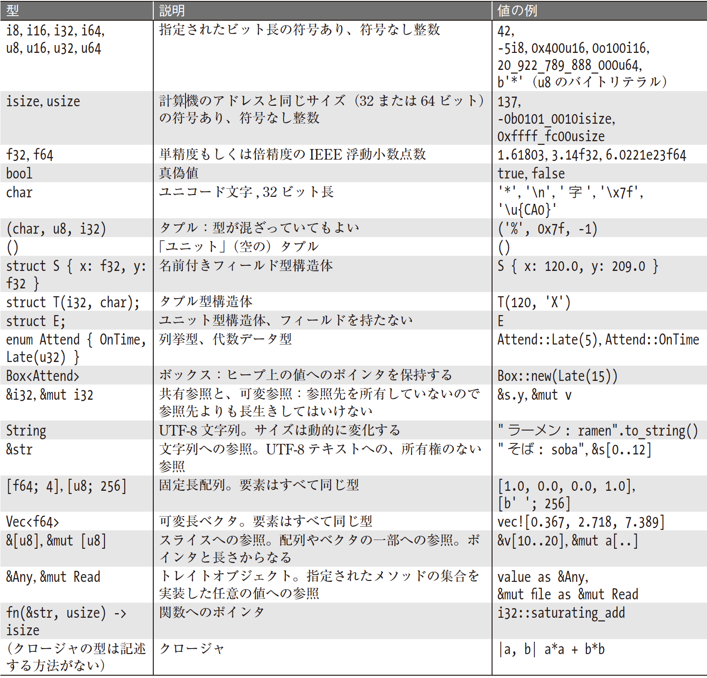

# 【Rust】基本型

- _プリミティブ型_＼



## 機械語型

### 整数型

| 大きさ | 符号あり | 符号なし |
| --- | --- | --- |
| 8-bit | `i8` | `u8` |
| 16-bit | `i16` | `u16` |
| 32-bit | `i32` | `u32` |
| 64-bit | `i64` | `u64` |
| arch | `isize` | `usize` |

<details>
<summary>整数リテラル表記</summary>

| 整数リテラル | 例 | 説明 |
| --- | --- | --- |
| 10進数 | `98_222` | `_`は見た目を区切るだけ |
| 16進数 | `0xfff` | `0x`から始める |
| 8進数 | `0o77` | `0o`から始める
| 2進数 | `0b1111_0000` | `0b`から始める、`_`は見た目の区切り
| バイト（`u8`のみ） | `b'A'` | `b`から始め、1文字を`'`で挟む |

</details>

#### 浮動小数点数 (`f32`|`f64`)

#### 論理値型 (`bool`)

`true` または `false`

#### 文字 (`char`)

## タプル (`([types...])`)

## ポインタ型

### 参照

<dl>
<dt><code>&T</code></dt>
<dd>型 <code>T</code> の変更不能な参照</dd>
<dt><code>&mut T</code></dt>
<dd>型 <code>T</code> の可変参照</dd>
</dl>

### Box

ヒープ上に値を確保する最も簡単な方法はBox::new を使う方法です。

```rust 
let t = (12, "eggs");
let b = Box::new(t);  // ヒープ上にタプルを確保
```

`t` の型は `(i32, &str)` なので、`b` の型は `Box<(i32, &str)>` となります。`Box::new()` はタプルを格納するのに十分なメモリをヒープ上に確保します。`b` が事前にリターンなどで**移動**されていない限り、`b` がスコープから外れると、メモリは即座に解放されます。移動は、Rust がヒープに確保した値を処理する上で不可欠な機能です。

#### raw ポインタ

Rust には、`*mut T` と `*const T` という raw ポインタ型があります。特徴は次の通りです:

- raw ポインタについては、Rust がまったく管理してくれないので、これを使うことは安全ではない。
- そのため、raw ポインタの参照解決は、`unsafe` ブロックの中でしかできない仕組みとなっている。
- `unsafe` ブロックの中でも正しく書かれていれば、安全性が保証される。

## 配列

型 `[T; N]` は、型 `T` の `N` 個の値の配列を表します。配列のサイズは、コンパイル時に定まり、型の一部となります。新しい要素を追加したり、縮小したりすることはできません。初期化されていない配列を作る記法はありません。

```rust 
// 「型 u32 が 6個」という配列の型を明示
let lazy_caterer: [u32; 6] = [1, 2, 4, 7, 11, 16];
// 暗黙的な [&str; 3]
let taxonomy = ["Animalia", "Arthropoda", "Insecta"];
// true を 10000 個含む配列
let mut sieve = [true; 10000];
```

### 配列の暗黙的なスライスへの変換

配列にあることが期待される有用なメソッド——例えば要素に対する繰り返し実行、検索、ソート、値の一括代入、フィルタなど——は、すべて配列ではなくスライスのメソッドとなっています。Rust は、メソッド探索時に、配列への参照を暗黙にスライスに変換するので、スライスのメソッドを配列に対して直接使うことができます:

```rust 
let mut chaos = [3, 5, 4, 1, 2];
chaos.sort();
assert_eq!(chaos, [1, 2, 3, 4, 5]);
```

## ベクタ

型 `Vec<T>` は、**`T` のベクタ**で、動的に確保される伸長可能な `T` 型の値の列を表します。ベクタの要素はヒープ上に取られるので、要素を追加したり、他のベクタをつなげたり、要素を削除したりして、大きさを任意に変更することができます。

```rust 
// マクロで作成
let mut v1 = vec![10, 20, 30, 40,];

// 配列リテラルを使用して作成
let mut v2 = vec![0; 2 * 3];

// new で作成
let mut v3 = Vec::new();

// イテレータが生成する値から作成
let mut v4: Vec<i32> = (0..5).collect();

// 要素の追加
v1.push(50);  // [10, 20, 30, 40, 50,]
// 要素の挿入
v1.insert(0, 5);  // [5, 10, 20, 30, 40, 50,]
// 特定のインデックスの要素を削除
v1.remove(0);  // [10, 20, 30, 40, 50,]
// 末尾要素の取り出し
let fifty = v1.pop();  // 50
```

`Vec<T>` の構成:

- ヒープ上にアロケートされている要素を保持するためのバッファへのポインタ
- バッファに保持できる容量
- 現在保持している要素数

### バッファの再確保

バッファが容量の上限に達しているときに新たに要素を追加しようとすると、より大きなバッファ（元から2倍のサイズ）が確保され、現在の要素がそちらにコピーされ、ベクタのポインタと容量が更新されて新しいバッファを指すようになり、古いバッファは解放されます。

ベクタが必要とする要素の数が前もってわかっているなら、`Vec::new` ではなく `Vec::with_capacity` を用いて、要素をすべて保持するのに十分大きなバッファを最初から用意して、ベクタを作ることができます。こうすればバッファの範囲内であれば再確保は行われません:

```rust 
let mut v = Vec::with_capacity(2);
assert_eq!(v.len(), 0);
assert_eq!(v.capacity(), 2);
v.push(1);
v.push(2);
assert_eq!(v.len(), 2);
assert_eq!(v.capacity(), 2);
v.push(3);
assert_eq!(v.len(), 3);
assert_eq!(v.capacity(), 4);
```

## スライス

型 `&[T]` と `&mut [T]` は、**`T` の共有スライス**および **`T` の可変スライス**と呼ばれ、配列やベクタなどの一部の連続した要素への参照です。最初の要素へのポインタと、そこからのアクセスできる要素の数を持っていると思えばいいです。可変スライス `&mut [T]` では、要素を読み出すことも変更することもできますが、他のスレッドと共有することはできません。共有スライス `&[T] `は、複数の読み出しスレッドが共有することができますが、要素を変更することはできません。

## 文字列型

### 文字列リテラル

文字列リテラルはダブルクォートで囲みます:

```rust 
// エスケープシーケンスを使用
let speech1 = "\"Ouch!\" said the well.\n";

// 複数行で記述1（改行と冒頭のスペースは含まれる）
let speech2 = "In the room the women come and go,
    Singing of Mount Abora");
    
// 複数行で記述2（改行と冒頭のスペースは削除される）
let speech3 = "It was a bright, cold day in April, and \
    there were four of us-\
    more or less.");

// 「raw string」
let default_win_install_path = r"C:\Program Files\Gorillas";
let pattern = Regex::new(r"\d+(\.\d+)*");

// 「ハッシュ付き raw string」
println!(r###"
  この raw string は 'r###' で始まる。
  したがって、引用符（'"'）の直後に続く
  3つのシャープ ('###') に到達するまで終了しません。
"###);
```

### バイト文字列

`b` を冒頭に付けた文字列リテラルは**バイト文字列**となります。型は `u8` です。文字は、ASCII 文字とエスケープシーケンス (\xHH) だけで書く必要があります:

```rust 
let method = b'GET'  // [u8; 3]
```

## `Rc` と `Arc`

Rust は参照カウントのポインタ型 `Rc` と `Arc` を用意しています。 これらの唯一の違いは次の通りです:

<dl>
<dt><strong><code>Rc</code></strong> (reference count)</dt>
<dd>高速だがスレッド安全でない</dd>
<dt><strong><code>Arc</code></strong> (atomic reference count)</dt>
<dd>複数スレッド間で直接共有しても安全</dd>
</dl>

すべての型 `T` に対して、`Rc<T>` の値は、ヒープ上に確保された`T` とそれに付随する参照カウントを指すポインタとなります。`Rc<T>` をクローンすると、`T` の値はコピーされず、同じものを指すポインタが作られ、参照カウントがインクリメントされます。

```rust 
// これらすべては同じ参照である
let s: Rc<String> = Rc:new("shirataki".to_string());
let t = s.clone();
let u = t.clone();
```